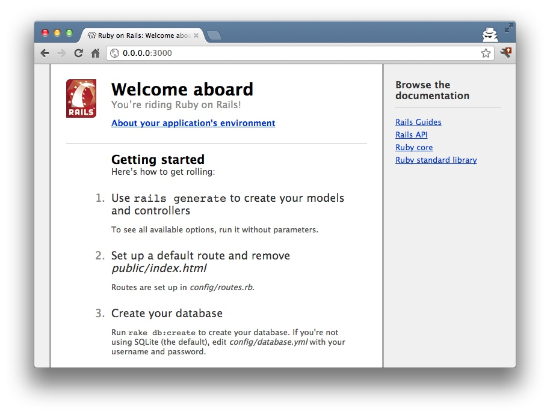
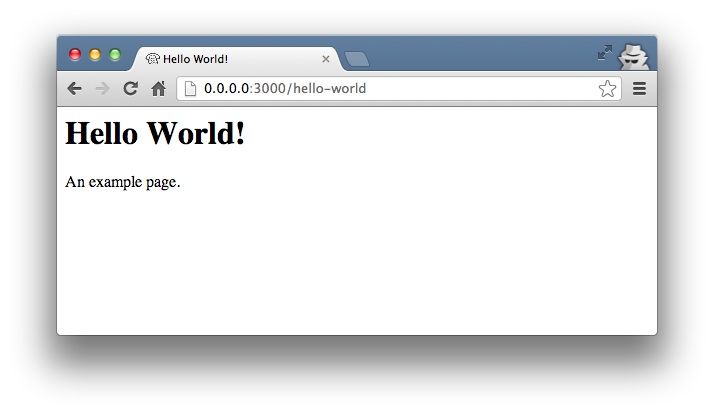
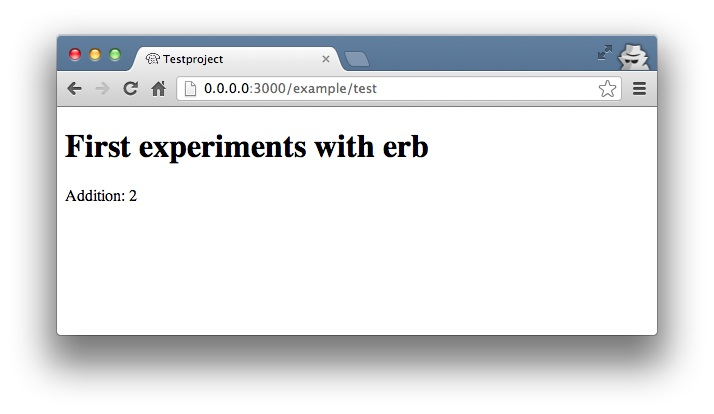
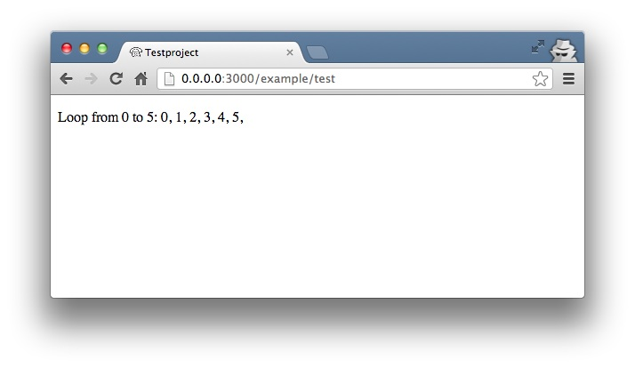
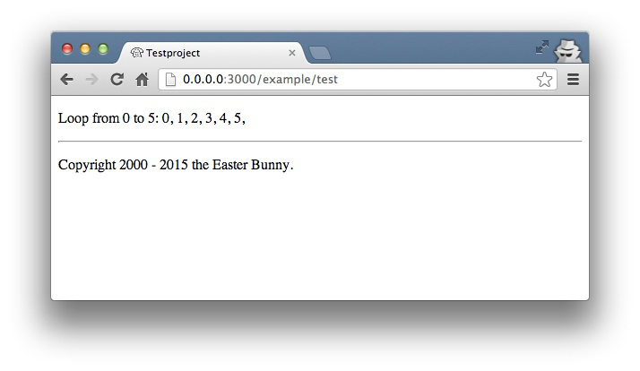
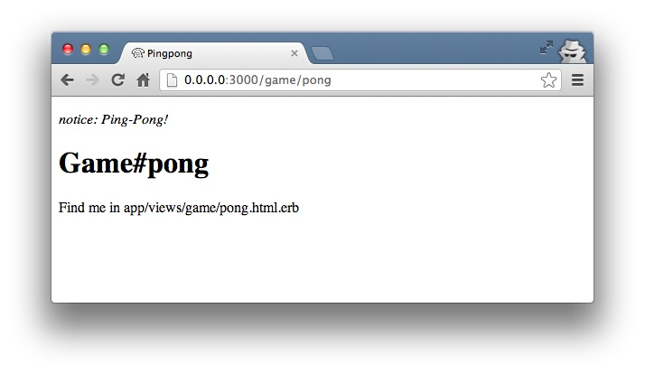

First Steps with Rails
======================
### Introduction

Now that you have painstakingly read your way through [Chapter 2 - Ruby Basics](chapter02-ruby-basics.html) we 
can move on to a more exciting bit. In this chapter, we will start our first 
Ruby on Rails project and find our way into the topic step by step.

We will use Ruby on Rails version 4.2.1. Please update to this version in
case have installed an older one.

> **Note**
>
> In this chapter, we will also move on the double in some cases. Once
> more, there will be some typical chicken and egg problems.

### Environment (Development)

By default a Rails project offers three different environments:

-   *Development*

-   *Test*

-   *Production*

In this chapter, we are only working with the Development environment.
Once you have gained a better feeling for Rails, we will start using
tests and then we will need the corresponding environment (where, for
example, the Test database is populated when you start a test and then
cleared). Later, I will explain the various scenarios to show how you can
roll out your Rails application from the Development environment to the
Production environment.

The Development environment has everything you need for developing,
apart from an editor and a web browser. So you do not need to install a
special web server, but can use the integrated Rails web server. It does
not exactly have extremely high performance, but you do not need that
for developing. Later, you can switch to big web servers like Apache or
Nginx. The same applies to the database.

In order to work in the Development environment, you do not need to make
any changes to start with - all commands work by default.

#### SQLite-3 Database

In terms of the database, the main focus in this chapter is once more
not on optimum performance, but on showing you a simple way of getting
started. That's why we are using the SQLite-3 database. You already have
everything you need fully installed and you don't need to worry about
anything. Later I will explain how you can use other databases (for
example MySQL).

### Why Is It All in English?

If you are a native English speaker, you may not find it surprising that
Rails apparently loves the English language. Even if you are not a
native English speaker, you should try to accept and even adopt Rails'
love for the English language. Much of it will then be much easier and
more logical. Most of the code then reads just like a normal English
sentence.
For example, many mechanisms automagically use plural or singular forms of
normal English words. If you get used to naming database fields and
tables with English terms (even if you are programming in a different
language), then you can make use of the whole power of this magic. This
mechanism is referred to as `Inflector` or *Inflections*.

If you are programming in a language other than English, it still makes
sense to use English names for variables, classes and methods. You can
write the comments in your own language, but if you take part in
international projects, you should obviously write the comments in
English as well. Yeah, sure … well written code does not need any
comments. ;-)

Static Content (HTML and Graphics Files)
----------------------------------------

If you are reading this text, you will already know that you can use
Rails to somehow output web pages. The question is just how it's done.
Let's first create a new Rails project.

### Create Rails Project

Before we even get going, please check that you are using Ruby version 2.2.1:

```bash
$ ruby -v
ruby 2.2.1p85 (2015-02-26 revision 49769) [x86_64-darwin14]
$
```

Next, check if Rails 4.2.1 is also installed:

```bash
$ rails -v
Rails 4.2.1
$
```

That's looking good. If you have an older version of Ruby or Rails
installed, please install the 4.4.1 version before you read any further.

Now we start by creating a new Rails project with the name
`testproject`. Ruby on Rails is a framework, so we first need to set up
the corresponding directory structure and basic configuration, including
several scripts. Easy as pie, just use the command
`rails new testproject`:

```bash
$ rails new testproject
    create
    create  README.rdoc
    create  Rakefile
    create  config.ru
    create  .gitignore
    [...]
$
```

> **Note**
>
> In previous versions of Rails, you had to do a
> `bundle install` first. With Rails 3.2 onwards, this is done
> automatically when you create a new Rails project. The Rails project
> then has all required *gems* available. A *gem* is a kind of software
> library. You can integrate certain ready-made functionalities with it,
> without having to reinvent the wheel.

Next, we check if the new Rails application 
is working by launching the integrated web server.

> **Tip**
>
> Depending on the operating system (for example, Mac OS X) and on your
> firewall settings, you may see a popup window when first starting a
> Rails application, asking you if the firewall should permit the
> corresponding connection. As we are only working locally, you can
> safely confirm.

```bash
$ cd testproject/
$ rails server
=> Booting WEBrick
=> Rails 4.2.1 application starting in development on http://localhost:3000
=> Run `rails server -h` for more startup options
=> Ctrl-C to shutdown server
[2015-04-14 18:52:26] INFO  WEBrick 1.3.1
[2015-04-14 18:52:26] INFO  ruby 2.2.0 (2014-12-25) [x86_64-darwin14]
[2015-04-14 18:52:26] INFO  WEBrick::HTTPServer#start: pid=81168 port=3000
```

The start of the Rails application is looking good. It tells us:

```bash
Rails 4.2.1 application starting in development on http://localhost:3000
```

So let's go to the URL <http://0.0.0.0:3000> or <http://localhost:3000>
in the web browser. Welcome aboard You're riding Ruby on Rails! …



Looks good. Rails seems to be working fine. The log of it tells what
just happend:

```bash
Started GET "/" for ::1 at 2015-04-14 19:11:32 +0200
Processing by Rails::WelcomeController#index as HTML
  Rendered /usr/local/lib/ruby/gems/2.2.0/gems/railties-4.2.1/lib/rails/templates/rails/welcome/index.html.erb (1.6ms)
Completed 200 OK in 31ms (Views: 9.0ms | ActiveRecord: 0.0ms)
```

If we now click the link “*About your application's environment*”, we
can more information on the current environment.

> **Important**
>
> With Ctrl+C you can stop the web server.

### Static Pages

There are certain static pages, images and JavaScript files that are
automatically output by Rails. Remember part of the output of the
command `rails new testproject`:

```bash
$ rails new testproject
    [...]
    create  public/404.html
    create  public/422.html
    create  public/500.html
    create  public/favicon.ico
    create  public/robots.txt
    [...]
```


The directory name `public` and the files it contains already look very
much like static pages. Hello World in Rails Let's have a go and create
the file `public/hello-world.html` with the following content:


```html
<html>
<head>
  <title>Hello World!</title>
</head>
<body>
  <h1>Hello World!</h1>
  <p>An example page.</p>
</body>
</html>
```

Now start the Rails web server with `rails server`

```bash
$ rails server
=> Booting WEBrick
=> Rails 4.2.1 application starting in development on http://localhost:3000
=> Run `rails server -h` for more startup options
=> Ctrl-C to shutdown server
[2015-04-14 19:15:02] INFO  WEBrick 1.3.1
[2015-04-14 19:15:02] INFO  ruby 2.2.1 (2015-02-26) [x86_64-darwin14]
[2015-04-14 19:15:02] INFO  WEBrick::HTTPServer#start: pid=10559 port=3000
```

We can have a look at this web page at the URL
<http://0.0.0.0:3000/hello-world>:



No output in the log means: This page was not handled by the Rails
framework. It was delivered directly from the webserver.

> **Note**
>
> We can of course also use the URL
> <http://0.0.0.0:3000/hello-world.html>. But Rails regards HTML and
> therefore the file ending `.html` as standard output format, so you
> can omit the “`.html`” here.

Now you know how you can integrate fully static pages in Rails. This is
useful for pages that never change and that you want to work even if
Rails is not currently working, for example because of an update. In a
production environment, you would usually put a classic web server such
as Apache or Nginx infront of the Rails server. Which is capable of
autonomously delivering static files from the `public` directory. You'll
learn how to set up a production webserver in [Chapter 15, Web Server in Production Mode](chapter15-production-webserver.html).

With Ctrl+C you can stop the Rails server.

Creating HTML Dynamically with erb
----------------------------------

The the content of an `erb` file will propably seem familiar to you. It
is a mixture of HTML and Ruby code (`erb` stands for **e**mbedded
**R**uby). erb pages are rendered as Views. This is the first time
for us to get in touch with the MVC
model. We need a controllercontroller to use a view. That can be
created it via the generator `rails generate controller`. Let's have a
look at the onboard help of this generator:

```bash
$ rails generate controller
Usage:
  rails generate controller NAME [action action] [options]

Options:
      [--skip-namespace], [--no-skip-namespace]  # Skip namespace (affects only isolated applications)
      [--skip-routes], [--no-skip-routes]        # Don't add routes to config/routes.rb.
  -e, [--template-engine=NAME]                   # Template engine to be invoked
                                                 # Default: erb
  -t, [--test-framework=NAME]                    # Test framework to be invoked
                                                 # Default: test_unit
      [--helper]                                 # Indicates when to generate helper
                                                 # Default: true
      [--assets]                                 # Indicates when to generate assets
                                                 # Default: true

Runtime options:
  -f, [--force]                    # Overwrite files that already exist
  -p, [--pretend], [--no-pretend]  # Run but do not make any changes
  -q, [--quiet], [--no-quiet]      # Suppress status output
  -s, [--skip], [--no-skip]        # Skip files that already exist

Description:
    Stubs out a new controller and its views. Pass the controller name, either
    CamelCased or under_scored, and a list of views as arguments.

    To create a controller within a module, specify the controller name as a
    path like 'parent_module/controller_name'.

    This generates a controller class in app/controllers and invokes helper,
    template engine, assets, and test framework generators.

Example:
    `rails generate controller CreditCards open debit credit close`

    CreditCards controller with URLs like /credit_cards/debit.
        Controller: app/controllers/credit_cards_controller.rb
        Test:       test/controllers/credit_cards_controller_test.rb
        Views:      app/views/credit_cards/debit.html.erb [...]
        Helper:     app/helpers/credit_cards_helper.rb
$
```

Nice! We are kindly provided with an example further down:

```bash
rails generate controller CreditCard open debit credit close
```

Doesn't really fit the bill for our case but I am feeling brave and
suggest that we simply try `rails generate controller Example
    test`

```bash
$ rails generate controller Example test
      create  app/controllers/example_controller.rb
       route  get 'example/test'
      invoke  erb
      create    app/views/example
      create    app/views/example/test.html.erb
      invoke  test_unit
      create    test/controllers/example_controller_test.rb
      invoke  helper
      create    app/helpers/example_helper.rb
      invoke    test_unit
      invoke  assets
      invoke    coffee
      create      app/assets/javascripts/example.coffee
      invoke    scss
      create      app/assets/stylesheets/example.scss
$
```

Phew... that's a lot of stuff being created. Amongst others, the file
`app/views/example/test.html.erb`. Let's have a closer look at it:

```erb
$ cat app/views/example/test.html.erb>
<h1>Example#test</h1>
<p>Find me in app/views/example/test.html.erb</p>
$
```

It's HTML, but for it to be a valid HTML page, something is “missing” at
the top and bottom (the missing HTML "rest" will be explained in [the section called "Layouts"](#layouts)). We
launch the web server to test it:

```bash
$ rails server
```

and have a look at the web page in the browser at the URL
<http://0.0.0.0:3000/example/test>:

In the log `log/development.log` we find the following lines:

```bash
Started GET "/example/test" for 127.0.0.1 at 2015-04-14 19:30:37 +0200
Processing by ExampleController#test as HTML
  Rendered example/test.html.erb within layouts/application (2.3ms)
Completed 200 OK in 2044ms (Views: 2031.9ms | ActiveRecord: 0.0ms)

Started GET "/assets/example.self-e3b0c44298fc1c149afbf4c8996fb92427ae41e4
649b934ca495991b7852b855.css?body=1" for 127.0.0.1 at 2015-04-14 19:30:39 +0200
Started GET "/assets/application.self-e80e8f2318043e8af94dddc2adad5a4f09739a8e
bb323b3ab31cd71d45fd9113.css?body=1" for 127.0.0.1 at 2015-04-14 19:30:39 +0200
Started GET "/assets/jquery.self-d03a5518f45df77341bdbe6201ba3bfa547ebba8ed64
f0ea56bfa5f96ea7c074.js?body=1" for 127.0.0.1 at 2015-04-14 19:30:39 +0200
Started GET "/assets/jquery_ujs.self-8e98a7a072a6cee1372d19fff9ff3e6aa1e39a37
d89d6f06861637d061113ee7.js?body=1" for 127.0.0.1 at 2015-04-14 19:30:39 +0200
Started GET "/assets/turbolinks.self-c37727e9bd6b2735da5c311aa83fead54ed0be6c
c8bd9a65309e9c5abe2cbfff.js?body=1" for 127.0.0.1 at 2015-04-14 19:30:39 +0200
Started GET "/assets/example.self-877aef30ae1b040ab8a3aba4e3e309a11d7f2612f44
dde450b5c157aa5f95c05.js?body=1" for 127.0.0.1 at 2015-04-14 19:30:39 +0200
Started GET "/assets/application.self-3b8dabdc891efe46b9a144b400ad69e37d7e587
6bdc39dee783419a69d7ca819.js?body=1" for 127.0.0.1 at 2015-04-14 19:30:39 +0200
```

That almost reads like normal English. Let us analyse the first part:

```bash
Started GET "/example/test" for 127.0.0.1 at 2015-04-14 19:30:37 +0200
Processing by ExampleController#test as HTML
  Rendered example/test.html.erb within layouts/application (2.3ms)
```

`localhost` (127.0.0.1) sent in an HTTP GET request for the URI
“`/example/test`”. That was then apparently rendered as HTML by the
controller `ExampleController` using the method test.

> **Note**
>
> The other lines tell us that a bunch of CSS and JavaScript files are
> compiled and than delivered. In production mode these would be
> precompiled and delivered as one CSS and one JavaScript

Now we just need to find the controller. Good thing you bought this book.
;-) All controllers are in the directory `app/controllers`, and there
you go, we indeed find the corresponding file
`app/controllers/example_controller.rb.`

```bash
$ ls -l app/controllers/
total 16
-rw-r--r--  1 xyz  EVS\Helpdesk  204 14 Apr 19:04 application_controller.rb
drwxr-xr-x  3 xyz  EVS\Helpdesk  102 14 Apr 19:04 concerns
-rw-r--r--  1 xyz  EVS\Helpdesk   69 14 Apr 19:26 example_controller.rb
$
```

Please open the file `app/controllers/example_controller.rb` with your
favorite editor:

```ruby
class ExampleController < ApplicationController
  def test
  end
end
```

That is very clear. The controller `ExampleController` is a descendant
of the `ApplicationController` and contains currently just one method
with the name test. This method contains currently no program logic.

You will probably ask yourself how Rails
knows that for the URL path [/example/test](/example/test) it should
process the controller `ExampleController` and the method `test`. This
is not determined by some magical logic, but by a *routing*
configuration. The current routings can be listed with the command
`rake routes`

```bash
$ rake routes
      Prefix Verb URI Pattern             Controller#Action
example_test GET  /example/test(.:format) example#test
$
```

These routes are configured in the file `config/routes.rb` which has
been auto-filled by the controller generator with a route to
`example/test`. The one line which is important for us right now is the
second one:

```bash
$ head -n 2 config/routes.rb
Rails.application.routes.draw do
  get 'example/test'
$
```

The `config/routes.rb` file includes a lot of examples. Give it a read
when you have time. We'll dive into that later [Chapter 6, Routes](chapter06-routing.html).

> **Important**
>
> A static file in the directory `public` always has higher priority
> than a route in the `config/routes.rb`! So if we were to save a static
> file `public/example/test` that file will be delivered.

### Programming in an erb File

`Erb` pages can contain Ruby code. You can use it to program and give
these page dynamic content.

Let's start with something very simple: adding 1 and 1. First we try out
the code in `irb`:

```bash
$ irb --simple-prompt
>> 1 + 1
=> 2
>> exit
$
```

That was easy. We fill the `erb` file `app/views/example/test.html.erb`
as follows:

```erb
<h1>First experiment with erb</h1>
<p>Addition:
  <%= 1 + 1 %>
</p>
```

Then use `rails server` to launch the web server.

```bash
$ rails server
```

Visit that page with the URL <http://0.0.0.0:3000/example/test>




> **Important**
>
> If you want to output the result of Ruby code, enclose the code within
> a `<%=` ... `%>`.

You may ask yourself: how can the result of adding two `Fixnums` be
displayed as a String? Let's first look up in `irb` if it really is a
`Fixnum`:

```bash
$ irb --simple-prompt
>> 1.class
=> Fixnum
>> (1 + 1).class
=> Fixnum
```

Yes, both the number 1 and the result of 1 + 1 is a `Fixnum`. What
happened? Rails is so intelligent that it automatically calls all
objects in a viewview (that is the file `test.html.erb`) that are not
already a string via the method `.to_s`, which always converts the
content of the object to a string ([the section called “Method to_s for Your Own Classes”](chapter02-ruby-basics.html#method-to-s-for-your-own-classes)). Once more, a brief trip to `irb`:

```bash
>> (1 + 1).to_s
=> "2"
>> (1 + 1).to_s.class
=> String
>> exit
```

You are now going to learn the finer points of `erb` step by step. Don't
worry, it's neither magic nor rocket science.

#### <% ... %> vs. <%= ... %>

In a `.html.erb `file, there are two kinds of Ruby code instructions in
addition to the HTML elements:

-   <% … %>

    Executes the Ruby code it contains, but does not output anything
    (unless you explicitly use something like `print` or `puts`).

-   <%= … %>

    Executes the Ruby code it contains and outputs the result as a
    String. If is is not a String the methode `to_s` will be called.

> **Important**
>
> The output of <%= ... %> is automatically escaped. So you don't need
> to worry about "dangerous" HTML.

Let's use an example, to make sure it all makes sense. We use `each` to
iterate through the Range `(0..5)`. Edit the
`app/views/example/test.html.erb` as follows:

```erb
<p>Loop from 0 to 5:
<% (0..5).each do |i| %>
<%= "#{i}, " %>
<% end %>
</p>
```

Open this view In the browser:



Let's now have a look at the HTML source code in the browser:

```html

<!DOCTYPE html>
<html>
<head>
  <title>Testproject2</title>
  <link rel="stylesheet" media="all" href="/assets/example.self-e3b0c44298fc1c149afbf4c8996fb92427ae41e4649b934ca495991b7852b855.css?body=1"  data-turbolinks-track="true" />
  <link rel="stylesheet" media="all" href="/assets/application.self-e80e8f2318043e8af94dddc2adad5a4f09739a8ebb323b3ab31cd71d45fd9113.css?body=1" data-turbolinks-track="true" />
  <script src="/assets/jquery.self-d03a5518f45df77341bdbe6201ba3bfa547ebba8ed64f0ea56bfa5f96ea7c074.js?body=1" data-turbolinks-track="true"></script>
  <script src="/assets/jquery_ujs.self-8e98a7a072a6cee1372d19fff9ff3e6aa1e39a37d89d6f06861637d061113ee7.js?body=1" data-turbolinks-track="true"></script>
  <script src="/assets/turbolinks.self-c37727e9bd6b2735da5c311aa83fead54ed0be6cc8bd9a65309e9c5abe2cbfff.js?body=1" data-turbolinks-track="true"></script>
  <script src="/assets/example.self-877aef30ae1b040ab8a3aba4e3e309a11d7f2612f44dde450b5c157aa5f95c05.js?body=1" data-turbolinks-track="true"></script>
  <script src="/assets/application.self-3b8dabdc891efe46b9a144b400ad69e37d7e5876bdc39dee783419a69d7ca819.js?body=1" data-turbolinks-track="true"></script>
  <meta name="csrf-param" content="authenticity_token" />
  <meta name="csrf-token" content="L4db79NWPpHFyE7x04OyqVUneGoywgqYWLuYSAPrVZ+d43yoboPigVsazNeBEISrm8bWiwdBHmBJirfd4U+TIg==" />
</head>
<body>

<p>Loop from 0 to 5:
0, 
1, 
2, 
3, 
4, 
5, 
</p>

</body>
</html>

```

Now you have the important tools to use Ruby code in a view.

#### Q & A

Potentially, there are two open questions:
**Q**: I don't understand anything. I can't cope with the Ruby code. Could you 
please explain that again? 
**A**: Is it possible that you have not completely worked your way through [Chapter 2, *Ruby Basics*](chapter02-ruby-basics.md)?
Please do take your time with it and have another thorough look.
Otherwise, the rest won't make any sense here. 
**Q**: I can understand the Ruby
code and the HTML output. But I don't get why some HTML code was
rendered around it if I didn't even write that HTML code. Where does it
come from, and can I influence it? 
**A**: Excellent question! We will get to that next.

### Layouts

The `erb` file in the directory `app/views/example/` only forms the core
of the later HTML page. By default, an automatically generated
`app/views/layouts/application.html.erb` is always rendered around it.
Let's have a closer look at it:

```erb
<!DOCTYPE html>
<html>
<head>
  <title>Testproject2</title>
  <%= stylesheet_link_tag    'application', media: 'all', 'data-turbolinks-track' => true %>
  <%= javascript_include_tag 'application', 'data-turbolinks-track' => true %>
  <%= csrf_meta_tags %>
</head>
<body>

<%= yield %>

</body>
</html>
```

The interesting bit is the line

```erb
<%= yield %>
```

With `<%= yield %>` the View file is included here. The lines
with the stylesheets, the JavaScript and the csrf\_meta\_tags can stay
as they are for now. They integrate <
We'll have a look into that in [chapter12 Asset pipeline](chapter12-asset-pipeline.html). No need to bother with that right now.

The file `app/views/layouts/application.html.erb` enables you to
determine the basic layout for the entire Rails application. If you want
to enter a `<hr>` for each page and above it a text, then you can do
this between the `<%= yield %>` and the `<body>` tag:

```html
<!DOCTYPE html>
<html>
<head>
  <title>Testproject</title>
  <%= stylesheet_link_tag    "application", :media => "all" %>
  <%= javascript_include_tag "application" %>
  <%= csrf_meta_tags %>
</head>
<body>

<h1>My Header</h1>
<hr>

<%= yield %>

</body>
</html>
```
You can also create other layouts in the directory `app/views/layouts/`
and apply these layouts depending on the relevant situation. But let's
leave it for now. The important thing is that you understand the basic
concept.

### Passing Instance Variables from a Controller to a View

One of the cardinal sins in the MVC model is to put too much program
logic into the view. That's more or less what used to be done frequently
in PHP programming in the past. I'm guilty of having done it myself. But
one of the aims of MVC is that any HTML designer can create a view
without having to worry about the programming. Yeah, yeah, … if only it
was always that easy. But let's just play it through in our minds: if I
have a value in the controller that I want to display in the view, then
I need a mechanism for this. This is referred to as *instance variable*
and always starts with a `@`. If you are not 100 % sure any more which
variable has which *scope*, then please have another quick look at 
[the section called “Scope of Variables”](chapter02-ruby-basics.html#scope-of-variables).

In the following example, we insert an instance variable for the current
time in the controller and then insert it in the view. So we are taking
programming intelligence from the view to the controller.

The controller file `app/controllers/example_controller.rb` looks like
this:

```erb
class ExampleController < ApplicationController
  def test
    @current_time = Time.now
  end
end
```

In the view file `app/views/example/test.html.erb` we can then access
this instance variable:

```erb
<p>
The current time is
<%= @current_time %>
</p>
```

With the controller and the view, we now have a clear separation of
programming logic and presentation logic. So now we can automatically
adjust the time in the controller in accordance with the user's time
zone, without the designer of the page having to worry about it. As
always, the method `to_s` is automatically applied in the view.

I am well aware that no-one will now jump up from their chair and shout:
“Thank you for enlightening me! From now on, I will only program neatly
in accordance with MVC.” The above example is just the first small step
in the right direction and shows how we can easily get values from the
controller to the view with instance variables.

### Partials

Even with small web projects, there are often elements that appear
repeatedly, for example a *footer* on the page with contact info
or a menu. Rails gives us the option of encapsulate this HTML code in
form of *partials* and then integrating it within a view. A partial
is also stored in the directory `app/views/example/`. But the file name
must start with an underscore (`_`).

As an example, we now add a mini footer to our page in a separate
partial. Copy the following content into the new file
`app/views/example/_footer.html.erb`:

```erb
<hr>
<p>
  Copyright 2009 - <%= Date.today.year %> the Easter Bunny.
</p>
```

> **Note**
>
> Yes, this is not the MVC way of doing it. Date.today.year should be
> defined in the Controller. I'm glad that you caught this mistake. I
> made it to show the use of a partial.

We edit the file `app/views/example/test.html.erb` as follows and insert
the partial via the command render:

```erb
<p>Loop from 0 to 5:
<% (0..5).each do |i| %>
<%= "#{i}, " %>
<% end %>
</p>

<%= render "footer" %>
```

So now we have the following files in the directory `app/views/example`:

```bash
$ ls app/views/example/
_footer.html.erb  test.html.erb
$
```

The new web page now looks like this:


> **Important**
>
> The name of a partial in the code is always specified *without* the
> preceding underscore (`_`) and *without* the file extension `.erb` and
> `.html`. But the actual file must have the underscore at the beginning
> of the file name and end with the file extension `.erb` and `.html`.

Partials can also be integrated from other areas of the subdirectory
`app/views`. For example, you can create a directory `app/views/shared`
for recurring and shared content and create a file `_footer.html.erb` in
this directory. You would then integrate this file into the `erb` code
via the line

```erb
<%= render "shared/footer" %>
```

#### Passing Variables to a Partial

Partials are great in the sense of the DRY
(**D**on't **R**epeat **Y**ourself) concept. But what makes them
really useful is the option of passing variables. Let's stick with the
copyright example. If we want to pass the start year as value, we can
integrate this by adding the following in the file
`app/views/example/_footer.html.erb`:

```erb
<hr>
<p>
Copyright <%= start_year %> - <%= Date.today.year %> the Easter Bunny.
</p>
```

So let's change the file `app/views/example/test.html.erb` as
follows:

```erb
<p>Loop from 0 to 5:
<% (0..5).each do |i| %>
<%= "#{i}, " %>
<% end %>
</p>

<%= render "footer", :start_year => '2000' %>
```

If we now go to the URL <http://0.0.0.0:3000/example/test>, we see the 2000:



Sometimes you need a partial that partially uses a local variable and
somewhere else you may need the same partial, but without the local
variable. We can take care of this in the partial itself with an if
statement:

```erb
<hr>
<p>
  Copyright
  <%= "#{start_year} - " if defined? start_year %>
  <%= Date.today.year %>
  the Easter Bunny.
</p>
```

> **Note**
>
> `defined?` can be used to check if an expression has been defined.

You can call this partial with `<%= render 'footer',
        :start_year => '2000' %>` and with `<%= render
        'footer' %>`.

#### Alternative Notation

In [the section called “Passing Variables to a Partial”](#passing-variables-to-a-partial) we only use the short 
form for rendering partials. Often, you will also see this long version:

```erb
<%= render :partial => "footer", :locals => { :start_year => '2000' } %>
```

#### Further Documentation on Partials

We have really only barely scratched the surface here. Partials are very
powerful tools. You can find the official Ruby on Rails documentation on
partials at:
<http://guides.rubyonrails.org/layouts_and_rendering.html#using-partials>.

Redirects
---------

The name says it all, really: *redirects* are commands that you can use
within the controller to “skip”, i.e. redirect, to other web pages.

> **Note**
>
> A redirect returns to the browser the response "302 Moved" with the
> new target. So each redirect does a roundtrip to the browser and back.

Let's create a new Rails project for a suitable example:

```bash
$ rails new redirect_example
[...]
$ cd redirect_example
$
```

Before we can redirect, we need a controller with at least two different
methods. Off we go then:

```bash
$ rails generate controller Game ping pong
      create  app/controllers/game_controller.rb
       route  get 'game/pong'
       route  get 'game/ping'
      invoke  erb
      create    app/views/game
      create    app/views/game/ping.html.erb
      create    app/views/game/pong.html.erb
      invoke  test_unit
      create    test/controllers/game_controller_test.rb
      invoke  helper
      create    app/helpers/game_helper.rb
      invoke    test_unit
      invoke  assets
      invoke    coffee
      create      app/assets/javascripts/game.coffee
      invoke    scss
      create      app/assets/stylesheets/game.scss
$
```

The controller `app/controllers/game_controller.rb` has the following
content:

```erb
class GameController < ApplicationController
  def ping
  end

  def pong
  end
end
```

Now for the redirect: how can we achieve that we get immediately
redirected to the method pong when we go to
<http://0.0.0.0:3000/game/ping>? Easy, you will say, we just change the
route in `config/routes.rb`. And you are right. So we don't
necessarily need a redirect. But if we want to process something else in
the method ping before redirecting, then this is only possible by using
a `redirect_to` in the controller `app/controllers/game_controller.rb`:

```erb
class GameController < ApplicationController
  def ping
   logger.info '+++  Example  +++'
   redirect_to game_pong_path
  end

  def pong
  end
end
```

But what is `game_pong_path`? Let's have a look a the routes generated
for this Rails application:

```bash
$ rake routes
   Prefix Verb URI Pattern          Controller#Action
game_ping GET  /game/ping(.:format) game#ping
game_pong GET  /game/pong(.:format) game#pong
$
```

> **Note**
>
> As you can see, the route to the *action* `ping` of the controller
> `GameController` now gets the name `game_ping` (see beginning of the
> line). We could also write the redirect like this:
>
>     `redirect_to :action => 'pong'`

I will explain the details and the individual options of the redirect
later in the context of each specific case. For now, you just need to
know that you can redirect not just to another method, but also to
another controller or an entirely different web page.

When we try to go to <http://0.0.0.0:3000/game/ping> we are
automatically redirected to <http://0.0.0.0:3000/game/pong> and in the
log output we see this:

```bash
Started GET "/game/ping" for 127.0.0.1 at 2015-04-15 17:50:04 +0200
Processing by GameController#ping as HTML
+++  Example  +++
Redirected to http://0.0.0.0:3000/game/pong
Completed 302 Found in 14ms (ActiveRecord: 0.0ms)


Started GET "/game/pong" for 127.0.0.1 at 2015-04-15 17:50:04 +0200
Processing by GameController#pong as HTML
  Rendered game/pong.html.erb within layouts/application (2.1ms)
Completed 200 OK in 2128ms (Views: 2127.4ms | ActiveRecord: 0.0ms)
```

### redirect\_to :back

If you want to redirect the user of your webapplication to the page he
has just been you can use `redirect_to :back`. This is very useful in a
scenario where your user first has to login to get access to a specific
page.

Flash Messages
--------------

In my eyes, the term “*flash messages*” is somewhat misleading. Almost
anyone would associate the term “*Flash*” with more or less colorful web
pages that were implemented with the Adobe Shockwave Flash Plug-in. But
in Ruby on Rails, flash messages are something completely different.
They are messages that are displayed, for example on the new page after
a redirect (see [Section 3.4, “Redirects”](#redirects)).

Flash messages are good friends with redirects. The two often work
together in a team to give the user feedback on an action he just
carried out. A typical example of a flash message is the system feedback
when a user has logged in. Often the user is redirected back to the
original page and gets the message “You are now logged in.”

As an example, we are once more constructing the ping pong scenario 
from [Section 3.4, “Redirects”](#redirects):

```bash
$ rails new pingpong
      [...]
$ cd pingpong
$ rails generate controller Game ping pong
      [...]
$
```

We fill the `app/controllers/game_controller.rb` with the following
content:

```erb
class GameController < ApplicationController
  def ping
   redirect_to game_pong_path, notice: 'Ping-Pong!'
  end

  def pong
  end
end
```

Now we start the Rails web server with `rails
    server` and use the browser to go to
<http://0.0.0.0:3000/game/ping>. We are redirected from ping to pong.
But the flash message "Ping-Pong!" is nowhere to be seen. We first need
to expand `app/views/layouts/application.html.erb`:

```erb
<!DOCTYPE html>
<html>
<head>
  <title>Pingpong</title>
  <%= stylesheet_link_tag    'application', media: 'all', 'data-turbolinks-track' => true %>
  <%= javascript_include_tag 'application', 'data-turbolinks-track' => true %>
  <%= csrf_meta_tags %>
</head>
<body>
  <%- flash.each do |name, message| %>
      <p>
        <i><%= "#{name}: #{message}" %></i>
      </p>
    <% end %>

  <%= yield %>
</body>
</html>
```

Now we see the flash message at the top of the page when we go to
<http://0.0.0.0:3000/game/ping> in the browser:



If we go to <http://0.0.0.0:3000/game/pong> we still see the normal Pong
page. But if we go to <http://0.0.0.0:3000/game/ping> we are redirected
to the Pong page and then the flash message is displayed at the top.

> **Tip**
>
> If you do not see a flash message that you were expecting, first check
> in the view to see if the flash message is output there.

### Different Types of Flash Message

Flash messages are automagically passed to the view in a hash. By
default, there are three different types: `error`, `warning` and
`notice`. You can also invent your own category and then get it in the
view later.

### Different Syntaxes

Depending on the programmer's preferences, you will find different
syntaxes of flash messages in practice. I am not going to take part in
the discussion about which is the best syntax, but just show you briefly
the two most common variations:

-   ```ruby redirect_to game_pong_path, notice: 'Ping-Pong!' ```

-   ```ruby 
        flash[:notice] = 'Ping-Pong!'
        redirect_to action: pong 
    ```

Please have a look at the official documentation at
<http://guides.rubyonrails.org/action_controller_overview.html#the-flash>
for more information.

### Why Are There Flash Messages At All?

You may wonder why there are flash messages in the first place. Couldn't
you just build them yourself if you need them? Yes, indeed. But flash
messages have the advantage that they offer a defined approach that is
the same for any programmer. So you don't need to start from scratch
every single time you need one.

The Rails Console
-----------------

The *console* in Rails is nothing more than an `irb` (see [Section 2.3, “irb”](chapter02-ruby-basics.html#irb)) built
around the Rails environment. The console is very useful both for
developing and for administration purposes, because the whole Rails
environment is represented and available.

For our working environment, we again use a variation of the ping pong
scenario from [Section 3.4, “Redirects”](#redirects):

```bash
$ rails new pingpong
      [...]
$ cd pingpong
$ rails generate controller Game ping pong
      [...]
$
```

Start the Rails console with the command `rails
    console`:

```bash
$ rails console
Loading development environment (Rails 4.2.1)
irb(main):001:0>
```

And you can use `exit` to get back out:

```bash
irb(main):001:0> exit
$
```

Many readers use this document on mobile devises. For them I try to keep
any code or terminal output width to a minimum. To save the real estate
which is by default occupied by `irb(main):001:0>` we can start
`rails console` with the parameter `-- --simple-prompt`.

```bash
$ rails console -- --simple-prompt
Loading development environment (Rails 4.2.1)
>> exit
$
```

Alternativly you can change the IRB configuration in the file `.irbrc`
which is located in your home directory. If you want to have the simple
prompt you have to add the following line in that file.

```bash
IRB.conf[:PROMPT_MODE] = :SIMPLE
```
> **Note**
>
> If the `.irbrc` file you can simply create on in your home directory

In the console, you have access to all variables that are also available
later in the proper application:

```bash
$ rails console
Loading development environment (Rails 4.2.1)
>> Rails.env
=> "development"
>> Rails.root
=> #<Pathname:/Users/xyz/pingpong>
>> exit
$
```

Already in [Chapter 4, ActiveRecord](chapter04-activerecord.html) we are going to be working lots with the console and will
soon begin to appreciate the possibilities it offers.

> **Tip**
>
> One of my best buddies when developing Rails applications is the Tab
> key. Whenever you are looking for a method for a particular problem,
> recreate it in the Rails console and then press the Tab key twice to
> list all available methods. The names of the methods are usually
> self-exlanatory.

### app

`app` is useful if you want to analyze things to do with
routing:

```bash
$ rails console
Loading development environment (Rails 4.2.1)
>> app.url_for(controller: 'game', action: 'ping')
=> "http://www.example.com/game/ping"
>> app.get '/game/ping'


Started GET "/game/ping" for 127.0.0.1 at 2015-04-15 18:47:26 +0200
Processing by GameController#ping as HTML
Redirected to http://www.example.com/game/pong
Completed 302 Found in 10ms (ActiveRecord: 0.0ms)
=> 302
>> app.get '/game/pong'


Started GET "/game/pong" for 127.0.0.1 at 2015-04-15 18:47:33 +0200
Processing by GameController#pong as HTML
  Rendered game/pong.html.erb within layouts/application (3.2ms)
Completed 200 OK in 2119ms (Views: 2117.6ms | ActiveRecord: 0.0ms)
=> 200
>> exit
$
```

Misc
----

You have now already created a simple Rails application and in the next
chapter you will dive deeply into the topic ActiveRecord. So now is a
good time to very briefly introduce a few terms that often surface in
the world of Rails.

### "Model View Controller" Architecture (MVC)

According to Wikipedia
<http://en.wikipedia.org/wiki/Model–view–controller>,
MVC is a design pattern that separates the representation of information
from the user's interaction with it.

MVC is a structure for software development. It was agreed that it makes
sense to have one part of the software in one place and another part of
the software in another place. Nothing more, nothing less. This
agreement has the enormous advantage that once you are used to this
concept, you know exactly where you can find or need to integrate a
certain functionaity in a Rails project.

#### Model

"Model" in this case means data model. By default, Rails applications
are an ActiveRecord data model (see [Chapter 4, AktiveRecord](chapter04-activerecord.html)).

All models can be found in the directory `app/models/.`

#### View

The "view" is responsible for the presentation of the application. It
takes care of rendering the web page, an XML or JSON file. A view could
also render a PDF or an ASCII text. It depends entirely on your
application.

You will find all the views in the directory `app/views/.`

#### Controller

Once a web page call has ended up in a route (see [Chapter 6, Routes](chapter06-routing.html)), it goes from there
to the controller. The route specifies a certain method (action) as
target. This method can then fulfil the desired tasks (such as finding a
specific set of data and saving it in an instance variable) and then
renders the desired view.

All controllers can be found in the directory `app/controllers/.`

### What is a Generator?

We have already used the command `rails generate
      controller`. It starts the generator with the name `controller`.
There are other generators as well. You can use the command
`rails generate` to display a list of available generators:

```bash
$ rails generate
Usage: rails generate GENERATOR [args] [options]

General options:
  -h, [--help]     # Print generator's options and usage
  -p, [--pretend]  # Run but do not make any changes
  -f, [--force]    # Overwrite files that already exist
  -s, [--skip]     # Skip files that already exist
  -q, [--quiet]    # Suppress status output

Please choose a generator below.

Rails:
  assets
  controller
  generator
  helper
  integration_test
  jbuilder
  job
  mailer
  migration
  model
  resource
  scaffold
  scaffold_controller
  task

Coffee:
  coffee:assets

Js:
  js:assets

TestUnit:
  test_unit:generator
  test_unit:job
  test_unit:plugin
$
```

What does a generator do? A generator makes a programmer's job easier by
doing some of the mindless tasks for you. It creates files and fills
them with content, depending on the parameters passed. You could do the
same manually, without the generator. So you do not have to use a
generator. It is primarily intended to save you work and avoid potential
errors that can easily arise from mindless repetitive tasks.

> **Tip**
>
> Someday you might want to create your own generator. Have a look at
> <http://guides.rubyonrails.org/generators.html> to find a description
> of how to do that.

### Helper

A helper method takes care of recurring tasks in a view. For example, if
you want to display stars (\*) for rating a restaurant and not a number
from 1 to 5, you can define the following helper in the file
`app/helpers/application_helper.rb` :

```ruby
module ApplicationHelper

  def render_stars(value)
    output = ''
    if (1..5).include?(value)
      value.times { output += '*'}
    end
    output
  end

end
```

With this helper, we can then apply the following code in a view:

```erb
<p>
  <b>Rating:</b> <%= render_stars(5) %>
</p>
```

You can also try out the helper in the console:

```bash
$ rails console
Loading development environment (Rails 4.2.1)
>> helper.render_stars(5)
=> "*****"
>> helper.render_stars(3)
=> "***"
>> exit
$
```

There are lots of predefined helpers in Rails and we will use some of
them in the next chapters. But you can also define your own custom
helpers. Any of the helpers from the file
`app/helpers/application_helper.rb` can be used in any view. Helpers
that you want to be only available in certain views must be defined for
each controller. When creating a controller, a file for helpers of that
controller is automatically created in `app/helpers`. This gives you the
option of defining helpers only for this controller or for the views of
this controller.

All helpers are in the directory `app/helpers/.`

### Rails Lingo

Here you find a couple of words which you'll often find in the Ruby on
Rails universe.

#### DRY - Don't repeat yourself

Many Rails programmers are big fans of DRY. DRY means purely and simply
that you should try to place repeated programming logic into separate
methods.

#### Refactoring

You often hear the word refactoring in the context of DRY. This involves
functioning applications that are further improved. The application in
itself remains unchanged in its interface. But its core is optimized,
amongst others through DRY.

#### Convention Over Configuration

Convention over configuration (also known as coding by convention, see
<http://en.wikipedia.org/wiki/Convention_over_configuration>) is an
important pillar of a Rails application. It states that the programmer
does not need to decide in favour of certain features when starting a
project and set these via configuration parameters. It specifies an
underlying basic consensus and this is set by default. But if you want
to work outside of this conventional basic consensus, then you will need
to change the corresponding parameters.
