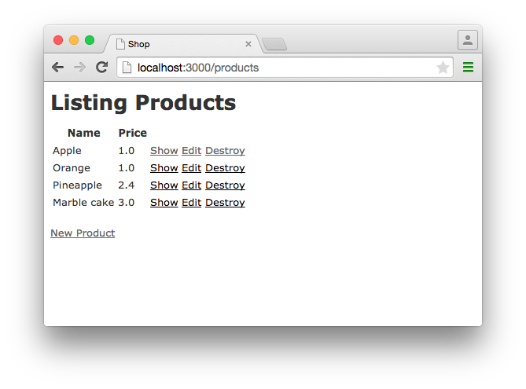
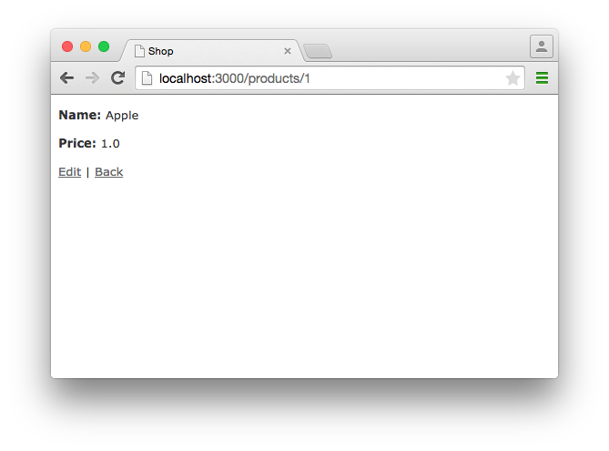
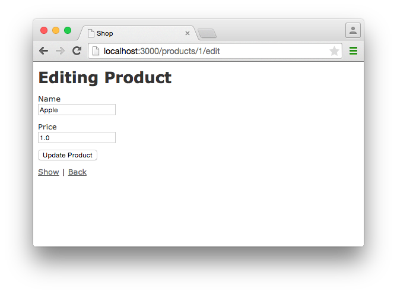
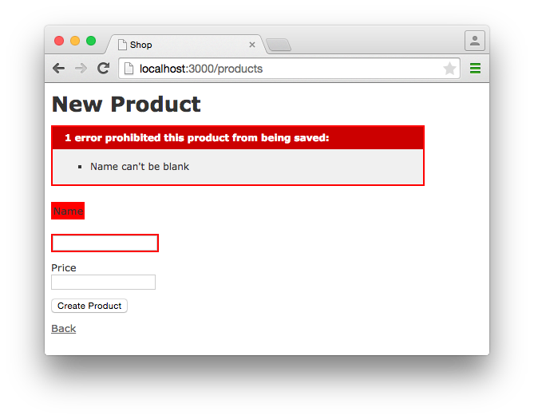
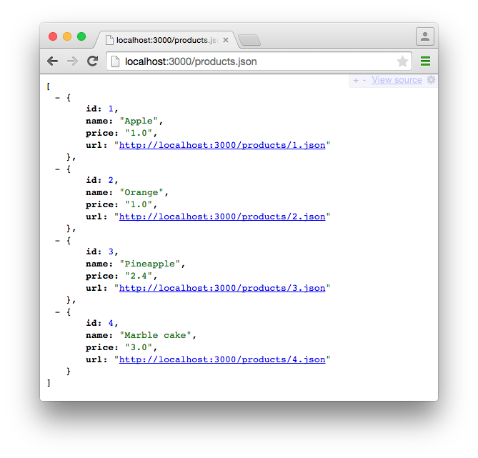
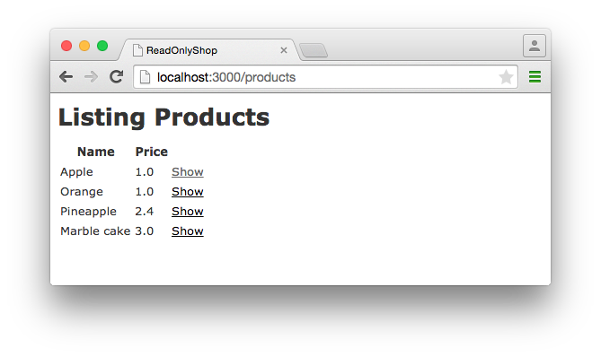

Scaffolding and REST
====================

Introduction
------------

Scaffolding means purely and simply that a basic *scaffold* for an application
is created via a generator. This scaffold not only contains the *model* but
also a simple Web GUI (*views*) and of course a *controller*. The programming
paradigm used for this is REST (Representational State Transfer).

You can find a definition of REST at
<http://en.wikipedia.org/wiki/Representational_state_transfer>. My super short
version: the inventor Roy Fielding described in 2000 how you can access data
with a simple set of rules within the concept of CRUD (see
<http://en.wikipedia.org/wiki/Create,_read,_update_and_delete>) and the
specification of the Hypertext Transfer Protocol (HTTP). CRUD is the
abbreviation for Create (SQL: INSERT), Read (SQL: SELECT), Update (SQL:
UPDATE) and Delete (SQL: Delete). This created URLs that are easy to read for
humans and have a certain logic. In this chapter, you will see examples
showing the individual paths for the different CRUD functions.

I think the greatest frustration with Rail arises regularly from the fact that
many beginners use scaffolding to get quick results without having proper
basic knowledge of Ruby and without knowing what ActiveRecord is. They don't
know what to do next. Fortunately, you have worked your way through [Chapter
2, Ruby Basics](chapter02-ruby-basics.html), [Chapter 3, First Steps with
Rails](chapter03-first-steps-with-rails.html) and [Chapter 4,
ActiveRecord](chapter04-activerecord.html), so you will be able to understand
and use scaffolding straight away.

> **Note**
>
> This chapter is an introduction to scaffolding, not an encyclopedia that
> covers all variations. Our focus is on the basic idea and on getting
> beginners started. The same applies to REST.

Generating a Scaffold
---------------------

Let's first use scaffolding to create a list of products for an online
shop. First, we need to create a new Rails application:

```bash
$ rails new shop
  [...]
$ cd shop
$
```

Let's look at the scaffolding options:

```bash
$ rails generate scaffold
Usage:
  rails generate scaffold NAME [field[:type][:index] field[:type][:index]]
  [options]

[...]

Description:
    Scaffolds an entire resource, from model and migration to controller and
    views, along with a full test suite. The resource is ready to use as a
    starting point for your RESTful, resource-oriented application.

    Pass the name of the model (in singular form), either CamelCased or
    under_scored, as the first argument, and an optional list of attribute
    pairs.

    Attributes are field arguments specifying the model's attributes. You can
    optionally pass the type and an index to each field. For instance:
    'title body:text tracking_id:integer:uniq' will generate a title field of
    string type, a body with text type and a tracking_id as an integer with an
    unique index. "index" could also be given instead of "uniq" if one desires
    a non unique index.

    As a special case, specifying 'password:digest' will generate a
    password_digest field of string type, and configure your generated model,
    controller, views, and test suite for use with ActiveModel
    has_secure_password (assuming they are using Rails defaults).

    Timestamps are added by default, so you don't have to specify them by hand
    as 'created_at:datetime updated_at:datetime'.

    You don't have to think up every attribute up front, but it helps to
    sketch out a few so you can start working with the resource immediately.

    For example, 'scaffold post title body:text published:boolean' gives
    you a model with those three attributes, a controller that handles
    the create/show/update/destroy, forms to create and edit your posts, and
    an index that lists them all, as well as a resources :posts declaration
    in config/routes.rb.

    If you want to remove all the generated files, run
    'rails destroy scaffold ModelName'.

Examples:
    `rails generate scaffold post`
    `rails generate scaffold post title body:text published:boolean`
    `rails generate scaffold purchase amount:decimal tracking_id:integer:uniq`
    `rails generate scaffold user email:uniq password:digest`

$
```

I'll keep it short: for our current state of knowledge, we can use `rails
generate scaffold` just like `rails generate model` (see [Section "Creating
Database/"Model""](chapter04-activerecord.html#creating-databasemodel)). Let's
now create the scaffold for the products:

```bash
$ rails generate scaffold product name 'price:decimal{7,2}'
      invoke  active_record
      create    db/migrate/20150418150127_create_products.rb
      create    app/models/product.rb
      invoke    test_unit
      create      test/models/product_test.rb
      create      test/fixtures/products.yml
      invoke  resource_route
       route    resources :products
      invoke  scaffold_controller
      create    app/controllers/products_controller.rb
      invoke    erb
      create      app/views/products
      create      app/views/products/index.html.erb
      create      app/views/products/edit.html.erb
      create      app/views/products/show.html.erb
      create      app/views/products/new.html.erb
      create      app/views/products/_form.html.erb
      invoke    test_unit
      create      test/controllers/products_controller_test.rb
      invoke    helper
      create      app/helpers/products_helper.rb
      invoke      test_unit
      invoke    jbuilder
      create      app/views/products/index.json.jbuilder
      create      app/views/products/show.json.jbuilder
      invoke  assets
      invoke    coffee
      create      app/assets/javascripts/products.coffee
      invoke    scss
      create      app/assets/stylesheets/products.scss
      invoke  scss
      create    app/assets/stylesheets/scaffolds.scss
$
```

As you can see, `rails generate scaffold` has already created the model.
So we can directly call `rake db:migrate`:

```bash
$ rake db:migrate
== 20150418150127 CreateProducts: migrating ===================================
-- create_table(:products)
   -> 0.0023s
== 20150418150127 CreateProducts: migrated (0.0024s) ==========================

$
```

Let's create the first six products in the `db/seeds.rb`. I am not quite
sure about Walter Scheel, but after all, this book is all about Rails,
not German post-war history.

```ruby
Product.create(name: 'Apple', price: 1)
Product.create(name: 'Orange', price: 1)
Product.create(name: 'Pineapple', price: 2.4)
Product.create(name: 'Marble cake', price: 3)
```

Populate with the example data:

```bash
$ rake db:seed
$
```

### The Routes

`rails generate scaffold` has created a route (more on this later in [Chapter
6, Routes](chapter06-routing.html)), a controller and several views for us
(see [Section "Creating HTML Dynamically with
erb"](chapter03-first-steps-with-rails.html#creating-html-dynamically-with-erb)).

We could also have done all of this manually. Scaffolding is merely an
automatism that does the work for us for some basic things. This is assuming
that you always want to view, create and delete records.

Without diving too deeply into the topic routes, let's just have a quick
look at the available routes for our example. You need to run
`rake routes`:

```bash
$ rake routes
      Prefix Verb   URI Pattern                  Controller#Action
    products GET    /products(.:format)          products#index
             POST   /products(.:format)          products#create
 new_product GET    /products/new(.:format)      products#new
edit_product GET    /products/:id/edit(.:format) products#edit
     product GET    /products/:id(.:format)      products#show
             PATCH  /products/:id(.:format)      products#update
             PUT    /products/:id(.:format)      products#update
             DELETE /products/:id(.:format)      products#destroy
$
```

These are all the routes and consequently URLs available in this Rails
application. All routes invoke actions (in other words, methods) in the
`ProductsController`.

### The Controller

Now it's about time we had a look at the file
`app/controllers/products_controller.rb`. Scaffold automatically creates the
methods index, show, new, create, update and destroy. These methods or actions
are called by the routes.

Here is the content of `app/controllers/products_controller.rb`

```ruby
class ProductsController < ApplicationController
  before_action :set_product, only: [:show, :edit, :update, :destroy]

  # GET /products
  # GET /products.json
  def index
    @products = Product.all
  end

  # GET /products/1
  # GET /products/1.json
  def show
  end

  # GET /products/new
  def new
    @product = Product.new
  end

  # GET /products/1/edit
  def edit
  end

  # POST /products
  # POST /products.json
  def create
    @product = Product.new(product_params)

    respond_to do |format|
      if @product.save
        format.html { redirect_to @product, notice: 'Product was successfully
        created.' }
        format.json { render :show, status: :created, location: @product }
      else
        format.html { render :new }
        format.json { render json: @product.errors, status: :unprocessable_entity }
      end
    end
  end

  # PATCH/PUT /products/1
  # PATCH/PUT /products/1.json
  def update
    respond_to do |format|
      if @product.update(product_params)
        format.html { redirect_to @product, notice: 'Product was successfully
        updated.' }
        format.json { render :show, status: :ok, location: @product }
      else
        format.html { render :edit }
        format.json { render json: @product.errors, status:
        :unprocessable_entity }
      end
    end
  end

  # DELETE /products/1
  # DELETE /products/1.json
  def destroy
    @product.destroy
    respond_to do |format|
      format.html { redirect_to products_url, notice: 'Product was
      successfully destroyed.' }
      format.json { head :no_content }
    end
  end

  private
    # Use callbacks to share common setup or constraints between actions.
    def set_product
      @product = Product.find(params[:id])
    end

    # Never trust parameters from the scary internet, only allow the white
    # list through.
    def product_params
      params.require(:product).permit(:name, :price)
    end
end
```

Let us take a moment and go through this controller.

#### `set_product`

A `before_action` calls a private method to set an instance variable
`@product` for the actions :show, :edit, :update and :destroy. That DRYs it up
nicely:

```ruby
before_action :set_product, only: [:show, :edit, :update, :destroy]

[...]

private
  # Use callbacks to share common setup or constraints between actions.
  def set_product
    @product = Product.find(params[:id])
  end
[...]
```

#### `index`

The `index` method sets the instance variable `@products`. It contains the
result of `Product.all`.

```ruby
# GET /products
# GET /products.json
def index
  @products = Product.all
end
```

#### `show`

The `show` method doesn't do anything. the `set_product` `before_action`
already set the instance variable `@product`. So there is not more to do.

```ruby
# GET /products/1
# GET /products/1.json
def show
end
```

#### `new`

The `new` method creates a new instance of Product and saves it in the
instance variable `@product`.

```ruby
# GET /products/new
def new
  @product = Product.new
end
```

#### `edit`

The `edit` method doesn't do anything. the `set_product` `before_action`
already set the instance variable `@product`. So there is not more to
do.

```ruby
# GET /products/1/edit
def edit
end
```

#### `create`

The `create` method uses `Product.new` to create a new instance of Product
and stores it in `@product`. The private method `product_params` is used
to filter the trusted parameters with a white list. When `@product` was
successfully saved a `redirect` to the `show` action is initiated for html
requests. If a validation error occured the `new` action will be rendered.

```ruby
# POST /products
# POST /products.json
def create
  @product = Product.new(product_params)

  respond_to do |format|
    if @product.save
      format.html { redirect_to @product, notice: 'Product was successfully
      created.' }
      format.json { render :show, status: :created, location: @product }
    else
      format.html { render :new }
      format.json { render json: @product.errors, status:
      :unprocessable_entity }
    end
  end
end

[...]

# Never trust parameters from the scary internet, only allow the white list
# through.
def product_params
  params.require(:product).permit(:name, :price)
end
```

#### `update`

The `update` method tries to update @product with the `product_params`. The
private method `product_params` is used to filter the trusted parameters
with a white list. When `@product` was successfully updated a `redirect`
to the `show` action is initiated for html requests. If a validation error
occured the `edit` action will be rendered.

```ruby
# PATCH/PUT /products/1
# PATCH/PUT /products/1.json
def update
  respond_to do |format|
    if @product.update(product_params)
      format.html { redirect_to @product, notice: 'Product was successfully
      updated.' }
      format.json { render :show, status: :ok, location: @product }
    else
      format.html { render :edit }
      format.json { render json: @product.errors, status:
      :unprocessable_entity }
    end
  end
end

[...]

# Never trust parameters from the scary internet, only allow the white list
# through.
def product_params
  params.require(:product).permit(:name, :price)
end
```

#### `destroy`

The `destroy` method destroys `@product` and redirects an html request to
the `index` action.

```ruby
# DELETE /products/1
# DELETE /products/1.json
def destroy
  @product.destroy
  respond_to do |format|
    format.html { redirect_to products_url, notice: 'Product was successfully
    destroyed.' }
    format.json { head :no_content }
  end
end
```

### The Views

Now we start the Rails web server:

```bash
$ rails server
=> Booting WEBrick
=> Rails 4.2.1 application starting in development on http://localhost:3000
=> Run `rails server -h` for more startup options
=> Ctrl-C to shutdown server
[2015-04-18 17:20:44] INFO  WEBrick 1.3.1
[2015-04-18 17:20:44] INFO  ruby 2.2.1 (2015-02-26) [x86_64-darwin14]
[2015-04-18 17:20:44] INFO  WEBrick::HTTPServer#start: pid=21563 port=3000
```

> **Note**
>
> If you get a warning from your built-in firewall now, this shows that
> you have worked through [Chapter 3, First Steps with
> Rails](chapter03-first-steps-with-rails.htlm) properly. ;-)

Now a little drum roll... dramatic suspense... launch the web browser
and go to the URL <http://localhost:3000/products>. You can see the list
of products as simple web page.



If you now click the link "New Product", you will see an input form for
a new record:


Use your browser's Back button to go back and click on the "Show" link
in the first line. You will then see the following page:



If you now click "Edit", you will see the editing view for this record:



And if you click "Destroy" on the Index page, you can delete a record
after confirming the message that pops up. Isn't that cool?! Within less
than 10 minutes, you have written a Web application that allows you to
**c**reate, **r**ead/**r**etrieve, **u**pdate and **d**elete/**d**estroy
records CRUD. That is the scaffolding magic. You can save a lot of
time.

#### Where Are the Views?

You can probably guess, but let's have a look at the directory
`app/views/products` anyway:

```bash
$ find app/views/products/
app/views/products/
app/views/products/_form.html.erb
app/views/products/edit.html.erb
app/views/products/index.html.erb
app/views/products/index.json.jbuilder
app/views/products/new.html.erb
app/views/products/show.html.erb
app/views/products/show.json.jbuilder
$
```

There are two different file extensions. The `html.erb` is for HTML
requests and the `json.jbuilder` is for JSON requests.

For `index`, `edit`, `new` and `show` the corresponding views are located
there.  As `new` and `edit` both require a form for editing the data, this is
stored in the partial `_form.html.erb` (see [the section called
"Partials"](chapter03-first-steps-with-rails.html#partials)) in accordance
with the principle of DRY (**D**on't **R**epeat **Y**ourself) and integrated
in `new.html.erb` and `edit.html.erb` with a `<%= render 'form' %>`.

Let's open the file `app/views/products/index.html.erb`:

```erb
<p id="notice"><%= notice %></p>

<h1>Listing Products</h1>

<table>
  <thead>
    <tr>
      <th>Name</th>
      <th>Price</th>
      <th colspan="3"></th>
    </tr>
  </thead>

  <tbody>
    <% @products.each do |product| %>
      <tr>
        <td><%= product.name %></td>
        <td><%= product.price %></td>
        <td><%= link_to 'Show', product %></td>
        <td><%= link_to 'Edit', edit_product_path(product) %></td>
        <td><%= link_to 'Destroy', product, method: :delete, data: { confirm:
        'Are you sure?' } %></td>
      </tr>
    <% end %>
  </tbody>
</table>

<br>

<%= link_to 'New Product', new_product_path %>
```

You are now an old hand when it comes to ERB, so you'll be able to read
and understand the code without any problems. If in doubt, have a quick
look at [the section called "Programming in an erb
File"](chapter03-first-steps-with-rails.html#programming-in-an-erb-file).

#### `link_to`

In the views generated by the scaffold generator, you first came across the
helper `link_to`. This creates `<a hre ...>` links. You can of course also
enter a link manually via `<a href="...">` in the erb, but for linrks within a
Rails project, `link_to` is more practical, because you can use the names of
the routes as a target. The code becomes much easier to read. In the above
example, there are the following routes:

```bash
$ rake routes
      Prefix Verb   URI Pattern                  Controller#Action
    products GET    /products(.:format)          products#index
             POST   /products(.:format)          products#create
 new_product GET    /products/new(.:format)      products#new
edit_product GET    /products/:id/edit(.:format) products#edit
     product GET    /products/:id(.:format)      products#show
             PATCH  /products/:id(.:format)      products#update
             PUT    /products/:id(.:format)      products#update
             DELETE /products/:id(.:format)      products#destroy
$
```

The first part of this route is the name of the route. With a new call, this
is `new_product`. A link to `new_product` looks like this in the erb code (you
can see it at the end of the file `app/views/products/index.html.erb`):

```erb
<%= link_to 'New Product', new_product_path %>
```

In the HTML code of the generated page (<http://localhost:3000/products>)
you can see the result:

```erb
<%= link_to 'New Product', new_product_path %>
```

With `link_to` you can also link to resources within a RESTful resource.
Again, you can find examples for this in `app/views/products/index.html.erb`.
In the table, a `show`, an `edit` and a `destroy` link is rendered for each
`product`:

```erb
<tbody>
  <% @products.each do |product| %>
    <tr>
      <td><%= product.name %></td>
      <td><%= product.price %></td>
      <td><%= link_to 'Show', product %></td>
      <td><%= link_to 'Edit', edit_product_path(product) %></td>
      <td><%= link_to 'Destroy', product, method: :delete, data: { confirm:
      'Are you sure?' } %></td>
    </tr>
  <% end %>
</tbody>
```

From the resource and the selected route, Rails automatically determines the
required URL and the required HTTP verb (in other words, whether it is a POST,
GET, PUT or DELETE). For index and show calls, you need to observe the
difference between singular and plural. `link_to 'Show', product` links to a
single record and `link_to 'Show', products_path` links to the index view.

Whether the name of the route is used with or without the suffix `_path` in
`link_to` depends on whether Rails can "derive" the route from the other
specified information. If only one object is specified (in our example, the
variable `product`), then Rails automatically assumes that it is a show route.

Examples:

| ERD-Code | Explanation |  
| ---- | ----------------- |  
| `link_to 'Show', Product.first`  | Link to the first product.| 
| `link_to 'New Product', new_product_path` | Link to the Web interface where a new product can be created. | 
| `link_to 'Edit', edit_product_path(Product.first)` | Link to the form where the first product can be edited. |
| `link_to 'Destroy', Product.first, method: :delete` | Link to deleting the first product. |


#### `form_for`

In the partial used by `new` and `edit`, `app/views/products/_form.html.erb`,
you will find the following code for the product form:

```erb
<%= form_for(@product) do |f| %>
  <% if @product.errors.any? %>
    <div id="error_explanation">
      <h2><%= pluralize(@product.errors.count, "error") %> prohibited this
      product from being saved:</h2>

      <ul>
      <% @product.errors.full_messages.each do |message| %>
        <li><%= message %></li>
      <% end %>
      </ul>
    </div>
  <% end %>

  <div class="field">
    <%= f.label :name %><br>
    <%= f.text_field :name %>
  </div>
  <div class="field">
    <%= f.label :price %><br>
    <%= f.text_field :price %>
  </div>
  <div class="actions">
    <%= f.submit %>
  </div>
<% end %>
```

In a block, the helper `form_for` takes care of creating the HTML form via
which the user can enter the data for the record or edit it. If you delete a
complete `<div class="field">` element here, this can no longer be used for
input in the web interface. I am not going to comment on all possible form
field variations at this point. The most frequently used ones will appear in
examples later on and be explained then (if they are not self-explanatory).

> **Note**
>
> You can find an overview of all form helpers at
> <http://guides.rubyonrails.org/form_helpers.html>

When using validations in the model, any validation errors that occur
are displayed in the following code at the head of the form:

```erb
<% if @product.errors.any? %>
    <div id="error_explanation">
      <h2><%= pluralize(@product.errors.count, "error") %> prohibited this
      product from being saved:</h2>

      <ul>
      <% @product.errors.full_messages.each do |message| %>
        <li><%= message %></li>
      <% end %>
      </ul>
    </div>
  <% end %>
```

Let's add a small validation to the `app/models/product.rb` model:

```ruby
class Product < ActiveRecord::Base
  validates :name,
            presence: true
end
```

When ever somebody wants to save a product which doesn't have a name
Rails will show this Flash Error:



#### Access via JSON

By default, Rails' scaffolding generates not just access via HTML for human
users, but also a direct interface for machines. The same methods `index`,
`show`, `new`, `create`, `update` and `destroy` can be called via this
interface, but in a format that is easier to read for machines. As an example,
we will demonstrate the `index` action via which all data can be read in one
go. With the same idea, data can be removed (`destroy`) or edited (`update`).

JSON (see
[http://en.wikipedia.org/wiki/Json](http://de.wikipedia.org/wiki/JavaScript_Object_Notation))
seems to be the new cool kid. So we use JSON.

If you do not require machine-readable access to data, you can remove these
lines in the file `Gemfile` (followed by the command `bundle`).

```ruby
# Build JSON APIs with ease. Read more: https://github.com/rails/jbuilder       
gem 'jbuilder', '~> 2.0'
```

Of course you can delete the `format.json` lines manually too. But please
don't forget to delete the JSON view files too.

##### JSON as Default

Right at the beginning of `app/controllers/products_controller.rb` you
will find the entry for the index action:

```ruby
# GET /products
# GET /products.json
def index
  @products = Product.all
end
```

The code is straightforward. In the instance variable `@products`, all
products are saved. The view `app/views/products/index.json.jbuilder`
contains the following code to render the JSON:

```json
json.array!(@products) do |product|
  json.extract! product, :id, :name, :price
  json.url product_url(product, format: :json)
end
```

You can use your browser to fetch the JSON output. Just open
<http://localhost:3000/products.json> and view the result. I installed a JSON
view extension in my Chrome browser to get a nicer format.



If you do not want the JSON output, you need to delete the `json.jbuilder`
files.

##### JSON and XML Together

If you ever need a JSON and XML interface in a Rails application, you just
need to specify both variants in the controller in the block `respond_to`.
Here is an example with the `app/controllers/products_controller.rb` in the
`index` action:

```ruby
# GET /products
# GET /products.json
# GET /products.xml
def index
  @products = product.all

  respond_to do |format|
    format.html # index.html.erb
    format.json { render json: @products }
    format.xml { render xml: @products }
  end
end
```

When Should You Use Scaffolding?
--------------------------------

You should never use scaffolding just for the sake of it. There are Rails
developers who never use scaffolding and always build everything manually. I
find scaffolding quite useful for quickly getting into a new project. But it
is always just the beginning.

### Example for a Minimal Project

Let's assume we need a web page quickly with which we can list products and
represent them individually. But we do not require an editing or deleting
function. In that case, a large part of the code created via scaffold would be
useless and have to be deleted. Let's try it out as follows:

```bash
$ rails new read-only-shop
  [...]
$ cd read-only-shop
$ rails generate scaffold product name 'price:decimal{7,2}' 
    invoke  active_record
    create    db/migrate/20150419150533_create_products.rb
    create    app/models/product.rb
    invoke    test_unit
    create      test/models/product_test.rb
    create      test/fixtures/products.yml
    invoke  resource_route
     route    resources :products
    invoke  scaffold_controller
    create    app/controllers/products_controller.rb
    invoke    erb
    create      app/views/products
    create      app/views/products/index.html.erb
    create      app/views/products/edit.html.erb
    create      app/views/products/show.html.erb
    create      app/views/products/new.html.erb
    create      app/views/products/_form.html.erb
    invoke    test_unit
    create      test/controllers/products_controller_test.rb
    invoke    helper
    create      app/helpers/products_helper.rb
    invoke      test_unit
    invoke    jbuilder
    create      app/views/products/index.json.jbuilder
    create      app/views/products/show.json.jbuilder
    invoke  assets
    invoke    coffee
    create      app/assets/javascripts/products.coffee
    invoke    scss
    create      app/assets/stylesheets/products.scss
    invoke  scss
    create    app/assets/stylesheets/scaffolds.scss
$ rake db:migrate
  [...]
$
```

Now create the `db/seeds.rb` with some demo products:

```ruby
Product.create(name: 'Apple', price: 1)
Product.create(name: 'Orange', price: 1)
Product.create(name: 'Pineapple', price: 2.4)
Product.create(name: 'Marble cake', price: 3)
```

And populate it with this data:

```bash
$ rake db:seed
$
```

As we only need `index` and `show`, we should delete the not required views:

```bash
$ rm app/views/products/_form.html.erb
$ rm app/views/products/new.html.erb 
$ rm app/views/products/edit.html.erb 
$
```

The `json.jbuilder` views are not needed either:

```bash
$ rm app/views/products/*.json.jbuilder
$
```

The file `app/controllers/products_controller.rb` can be simplified with
an editor. It should look like this:

```ruby
class ProductsController < ApplicationController
  # GET /products
  def index
    @products = Product.all
  end

  # GET /products/1
  def show
    @product = Product.find(params[:id])
  end
end
```

We only need the routes for `index` and `show`. Please open the file
`config/routes.rb` and edit it as follows:

```ruby
Rails.application.routes.draw do
  resources :products, only: [:index, :show]
end
```

A `rake routes` shows us that really only `index` and `show` are routed now:

```bash
$ rake routes
  Prefix Verb URI Pattern             Controller#Action
products GET  /products(.:format)     products#index
 product GET  /products/:id(.:format) products#show
```

If we now start the server `rails server` and go to the URL
<http://localhost:3000/products>, we get an error message.


The same message will be displayed in the log:

```bash
$ rails server
=> Booting WEBrick
=> Rails 4.2.1 application starting in development on http://localhost:3000
=> Run `rails server -h` for more startup options
=> Ctrl-C to shutdown server
[2015-04-19 17:18:57] INFO  WEBrick 1.3.1
[2015-04-19 17:18:57] INFO  ruby 2.2.1 (2015-02-26) [x86_64-darwin14]
[2015-04-19 17:18:57] INFO  WEBrick::HTTPServer#start: pid=22987 port=3000


Started GET "/products" for ::1 at 2015-04-19 17:19:34 +0200
  ActiveRecord::SchemaMigration Load (0.1ms)  SELECT "schema_migrations".*
  FROM "schema_migrations"
Processing by ProductsController#index as HTML
  Product Load (0.2ms)  SELECT "products".* FROM "products"
  Rendered products/index.html.erb within layouts/application (22.3ms)
Completed 500 Internal Server Error in 55ms (ActiveRecord: 0.7ms)

ActionView::Template::Error (undefined method `edit_product_path' for
#<#<Class:0x007fa95920b278>:0x007fa959209ea0>):
    17:         <td><%= product.name %></td>
    18:         <td><%= product.price %></td>
    19:         <td><%= link_to 'Show', product %></td>
    20:         <td><%= link_to 'Edit', edit_product_path(product) %></td>
    21:         <td><%= link_to 'Destroy', product, method: :delete, data: {
    confirm: 'Are you sure?' } %></td>
    22:       </tr>
    23:     <% end %>
  app/views/products/index.html.erb:20:in `block in
  _app_views_products_index_html_erb__3218631573957912904_70182660610380'
  app/views/products/index.html.erb:15:in
  `_app_views_products_index_html_erb__3218631573957912904_70182660610380'
[...]
```

The error message states that we call an undefined method `edit_product_path`
in the view `app/views/products/index.html.erb`. As we only route `index` and
`show` now, there are no more `edit`, `destroy` or `new` methods any more. So
we need to adapt the file `app/views/products/index.html.erb` in the editor as
follows:

```erb
<table>
  <thead>
    <tr>
      <th>Name</th>
      <th>Price</th>
      <th></th>
    </tr>
  </thead>

  <tbody>
    <% @products.each do |product| %>
      <tr>
        <td><%= product.name %></td>
        <td><%= product.price %></td>
        <td><%= link_to 'Show', product %></td>
      </tr>
    <% end %>
  </tbody>
</table>
```

And while we are at it, we also edit the `app/views/products/show.html.erb`
accordingly:

```erb
<p>
  <strong>Name:</strong>
  <%= @product.name %>
</p>

<p>
  <strong>Price:</strong>
  <%= @product.price %>
</p>

<%= link_to 'Back', products_path %>
```

Now our application is finished. Start the Rails server with `rails server`
and open the URL <http://localhost:3000/products> in the browser.



> **Note**
>
> In this example, I am not commenting on the required changes in the tests,
> as this is not an exercise for test driven development but meant to
> demonstrate a way of working with scaffolding. TDD developers will quickly
> be able to adapt the tests.

### Conclusion

Have a go and try it out. Try working with scaffolds one time and without them
the next. Then you will soon get a feel for whether it fits into your working
method or not. I find that scaffolding makes my work much easier for standard
applications.
