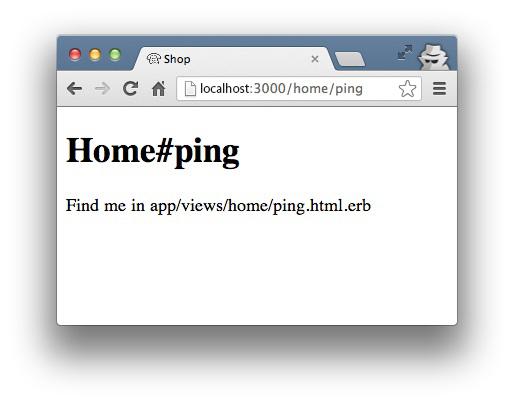
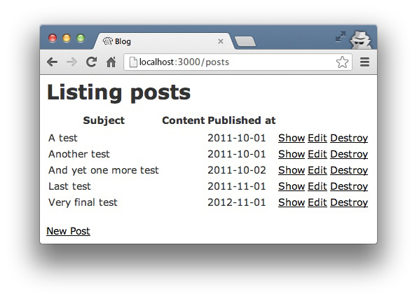
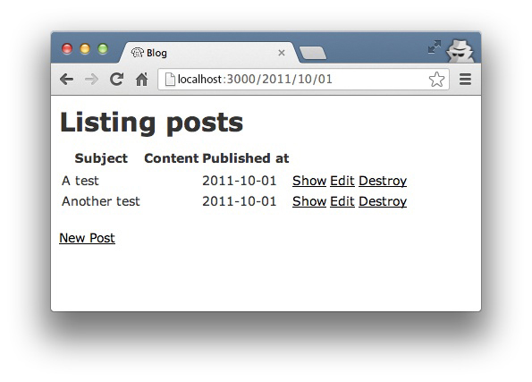
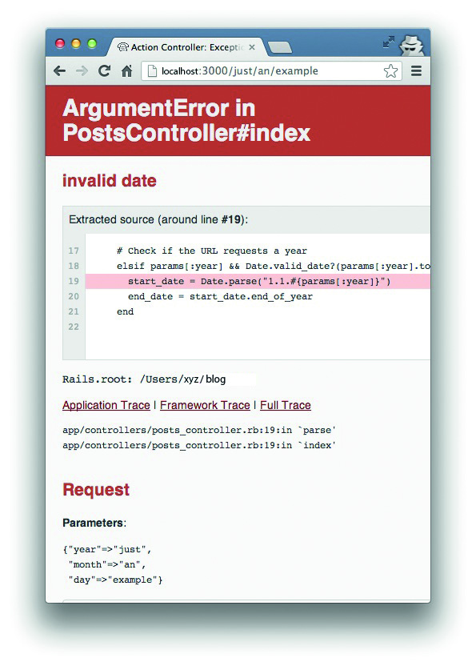
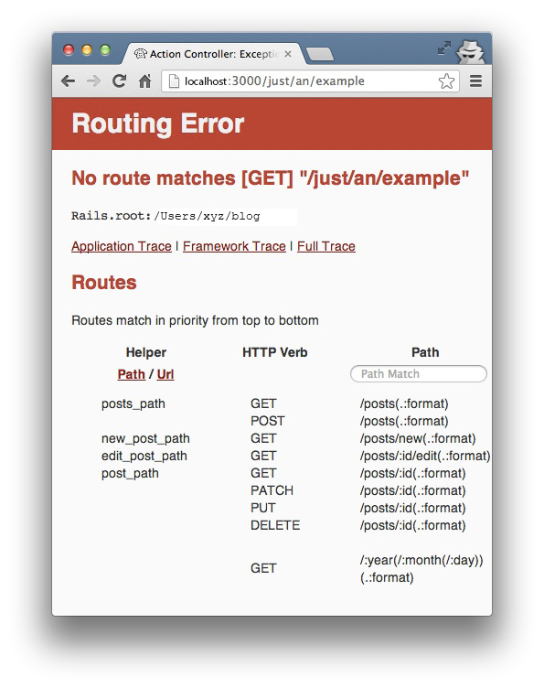

Routes
======

Introduction
------------

In [Section "Creating HTML Dynamically with erb"](chapter03-first-steps-with-rails.html#creating-html-dynamically-with-erb) and [Chapter 5, Scaffolding and REST](chapter05-scaffolding.html) we have already come across *routes*. The routes contained in
`config/routes.rb` define what happens in the Rails application when a
user of a Rails application fetches a URL. A route can be static and
dynamic and pass any dynamic values with variables to the controller. If
several routes apply to a URL, the one that is listed at the top of
`config/routes.rb` wins.

> **Tip**
>
> If you do not have much time, you can skip this chapter for now and
> get back to it later if you have any specific questions.

Let's first build a test Rails application so we can experiment:

```bash
$ rails new shop
  [...]
$ cd shop
$
```

With `rake routes` we can display the routes of a project. Let's try it
straight away in the freshly created project:

```bash
$ rake routes
You don't have any routes defined!

Please add some routes in config/routes.rb.

For more information about routes, see the Rails guide: http://guides.rubyonrails.org/routing.html.
```

That's what I call a good error message. It's a new Rails project, there
are no routes yet.

In case of a new Rails project, the file `config/routes.rb` has many
commented out examples. For the rest of this chapter we pretend that
these examples are not there and only display the newly entered routes.

HTTP GET Requests for Singular Resources
----------------------------------------

As you might know the HTTP protocol uses different so called verbs to
access content on the webserver (e.g. GET to request a page or POST to
send a form to the server). First we'll have a look at GET requests.

Create a controller with three pages:

```bash
$ rails generate controller Home index ping pong
      create  app/controllers/home_controller.rb
       route  get "home/pong"
       route  get "home/ping"
       route  get "home/index"
       [...]
$
```

Now `rake routes` lists a route for these three pages:

```bash
$ rake routes
    Prefix Verb URI Pattern           Controller#Action
home_index GET  /home/index(.:format) home#index
 home_ping GET  /home/ping(.:format)  home#ping
 home_pong GET  /home/pong(.:format)  home#pong
$
```

The pages can be accessed at the following URLs after starting the Rails
server with `rails server`:

-   <http://localhost:300/home/index>

    for `home_index GET /home/index(.:format)
              home#index`

-   <http://localhost:300/home/ping>

    for `home_ping GET /home/ping(.:format)
              home#ping`

-   <http://localhost:300/home/pong>

    for `home_pong GET /home/pong(.:format)
              home#pong`



With the output `home#index`, Rails tells us that the route
`home/index` goes into the controller home and there to
the action/method `index`. These routes are defined in the file
`config/routes.rb`. `rails generate controller
    Home index ping pong` has automatically inserted the following lines
there:

      get "home/index"

      get "home/ping"

      get "home/pong"

### Naming a Route

A route should also always have an internal name which doesn't change.
In [Section "HTTP Get Requests for Singular Resources"](#http-get-requests-for-singular-resources) there is the following route:

```bash
home_pong GET /home/pong(.:format)  home#pong
```

This route has the automatically created name `home_pong`. Generally,
you should always try to work with the name of the route within a Rails
application. So you would point a `link_to` to `home_pong` and not to
[/home/pong](/home/pong). This has the big advantage that you can later
edit (in the best case, optimize) the routing for visitors externally
and do not need to make any changes internally in the application. Of
course, you need to enter the old names with `:as` in that case.

### as

If you want to define the name of a route yourself, you can do so with
:as. For example, the line

```ruby
get "home/pong", as: 'different_name'
```

results in the route

```bash
different_name GET  /home/pong(.:format)  home#pong
```

### to

With to you can define an other destination for a rout. For example, the
line

```ruby
get "home/applepie", to: "home#ping"
```

results in the route

```bash
home_applepie GET  /home/applepie(.:format) home#ping
```

### Parameters

The routing engine can not just assign fixed routes but also pass
parameters which are part of the URL. A typical example would be date
specifications (e.g. <http://example.com/2010/12/> for all December
postings).

To demonstrate this, let's create a mini blog application:

```bash
$ rails new blog
  [...]
$ cd blog
$ rails generate scaffold post subject content published_at:date
  [...]
$ rake db:migrate
  [...]
$
```

As example data in the `db/seeds.rb` we take:

```ruby
Post.create(subject: 'A test', published_at: '01.10.2011')
Post.create(subject: 'Another test', published_at: '01.10.2011')
Post.create(subject: 'And yet one more test', published_at: '02.10.2011')
Post.create(subject: 'Last test', published_at: '01.11.2011')
Post.create(subject: 'Very final test', published_at: '01.11.2012')
```

With `rake db:seed` we populate the database with this data:

```bash
$ rake db:seed
$
```



If we now start the Rails server with `rails
      server` and go to the page <http://localhost:3000/posts> in the
browser, we will see this:

For this kind of blog it would of course be very useful if you could
render all entries for the year 2010 with the URL
<http://localhost:3000/2010/> and all entries for October 1st 2010 with
<http://localhost:3000/2010/10/01>. We can do this by using optional
parameters. Please enter the following configuration in the
`config/routes.rb`:

```ruby
Blog::Application.routes.draw do
  resources :posts

  get ':year(/:month(/:day))', to: 'posts#index'
end
```

The round brackets represent optional parameters. In this case, you have
to specify the year, but not necessarily the month or day. `rake routes`
shows the new route at the last line:

```bash
$ rake routes
   Prefix Verb   URI Pattern                      Controller#Action
    posts GET    /posts(.:format)                 posts#index
          POST   /posts(.:format)                 posts#create
 new_post GET    /posts/new(.:format)             posts#new
edit_post GET    /posts/:id/edit(.:format)        posts#edit
     post GET    /posts/:id(.:format)             posts#show
          PATCH  /posts/:id(.:format)             posts#update
          PUT    /posts/:id(.:format)             posts#update
          DELETE /posts/:id(.:format)             posts#destroy
          GET    /:year(/:month(/:day))(.:format) posts#index
$
```

If we do not change anything else, we still get the same result when
calling <http://localhost:3000/2011/> and <http://localhost:3000/2011/10/01>
as we did with <http://localhost:3000/posts>. But have a look at the
output of rails server for the request <http://localhost:3000/2011>

```bash
Started GET "/2011" for 127.0.0.1 at 2015-04-24 17:50:30 +0200
  ActiveRecord::SchemaMigration Load (0.2ms)  SELECT "schema_migrations".* FROM "schema_migrations"
Processing by PostsController#index as HTML
  Parameters: {"year"=>"2011"}
  Post Load (0.3ms)  SELECT "posts".* FROM "posts"
  Rendered posts/index.html.erb within layouts/application (9.7ms)
Completed 200 OK in 2263ms (Views: 2243.0ms | ActiveRecord: 0.6ms)
```

The route has been recognised and an `"year" => "2011"` has been assigned to the hash `params` (written misleadingly as
`Parameters` in the output). Going to the URL
<http://localhost:3000/2010/12/24> results in the following output, as
expected:

```bash
Started GET "/2010/12/24" for 127.0.0.1 at 2015-04-24 17:52:12 +0200
Processing by PostsController#index as HTML
  Parameters: {"year"=>"2010", "month"=>"12", "day"=>"24"}
  Post Load (0.2ms)  SELECT "posts".* FROM "posts"
  Rendered posts/index.html.erb within layouts/application (2.3ms)
Completed 200 OK in 33ms (Views: 31.9ms | ActiveRecord: 0.2ms)
```

In case of the URL <http://localhost:3000/2010/12/24>, the following
values have been saved in the hash `params`:
`"year"=>"2010", "month"=>"12",
      "day"=>"24".`

In the controller, we can access `params[]` to access the values defined
in the URL. We simply need to adapt the index method in
`app/controllers/posts_controller.rb` to output the `posts` entered for
the corresponding date, month or year:

```ruby
# GET /posts
# GET /posts.json
def index
  # Check if the URL requests a date.
  if Date.valid_date? params[:year].to_i, params[:month].to_i, params[:day].to_i
    start_date = Date.parse("#{params[:day]}.#{params[:month]}.#{params[:year]}")
    end_date = start_date

  # Check if the URL requests a month
  elsif Date.valid_date? params[:year].to_i, params[:month].to_i, 1
    start_date = Date.parse("1.#{params[:month]}.#{params[:year]}")
    end_date = start_date.end_of_month

  # Check if the URL requests a year
  elsif params[:year] && Date.valid_date?(params[:year].to_i, 1, 1)
    start_date = Date.parse("1.1.#{params[:year]}")
    end_date = start_date.end_of_year
  end

  if start_date && end_date
    @posts = Post.where(published_at: start_date..end_date)
  else
    @posts = Post.all
  end
end
```

If we now go to <http://localhost:3000/2011/10/01> , we can see all
`posts` of October 1st 2011.



### Constraints

In [the section called "Parameters"](#parameters) I showed you how you can read out parameters from the URL and pass
them to the controller. Unfortunately, the entry defined there in the
`config/routes.rb`

```ruby
get ':year(/:month(/:day))', to: 'posts#index'
```

has one important disadvantage: it does not verify the individual
elements. For example, the URL <http://localhost:3000/just/an/example>
will be matched just the same and then of course results in an error:



In the log output in` log/development.log` we can see the following
entry:

```bash
Started GET "/just/an/example" for ::1 at 2015-04-24 17:59:30 +0200
Processing by PostsController#index as HTML
  Parameters: {"year"=>"just", "month"=>"an", "day"=>"example"}
Completed 500 Internal Server Error in 2ms (ActiveRecord: 0.0ms)

ArgumentError (invalid date):
  app/controllers/posts_controller.rb:19:in `parse'
  app/controllers/posts_controller.rb:19:in `index'
```

Obviously, `Date.parse( "example.an.just")` cannot work. A date is made
up of numbers, not letters.

Constraints can define the content of the URL more precisely via regular
expressions. In the case of our blog, the `config/routes.rb` with
contraints would look like this:

```ruby
Blog::Application.routes.draw do
  resources :posts

  get ':year(/:month(/:day))', to: 'posts#index', constraints: { year: /\d{4}/, month: /\d{2}/, day: /\d{2}/ }
end
```

> **Warning**
>
> Please note that you cannot use regex anchors such as "\^" in regular
> expressions in a constraint.

If we go to the URL again with this configuration, Rails gives us an
error message "No route matches":



### Redirects

Our current application answers request in the format YYYY/MM/DD (4
digits for the year, 2 digits for the month and 2 digits for the day).
That is ok for machines but maybe a human would request a single digit
month (like January) and a single digit day without adding the extra 0
to make it two digits. We can fix that with a couple of redirect rules
which catch these URLs and redirect them to the correct ones.

```ruby
Blog::Application.routes.draw do
  resources :posts

  get ':year/:month/:day', to: redirect("/%{year}/0%{month}/0%{day}"), constraints: { year: /\d{4}/, month: /\d{1}/, day: /\d{1}/ }
  get ':year/:month/:day', to: redirect("/%{year}/0%{month}/%{day}"), constraints: { year: /\d{4}/, month: /\d{1}/, day: /\d{2}/ }
  get ':year/:month/:day', to: redirect("/%{year}/%{month}/0%{day}"), constraints: { year: /\d{4}/, month: /\d{2}/, day: /\d{1}/ }
  get ':year/:month', to: redirect("/%{year}/0%{month}"), constraints: { year: /\d{4}/, month: /\d{1}/ }

  get ':year(/:month(/:day))', to: 'posts#index', constraints: { year: /\d{4}/, month: /\d{2}/, day: /\d{2}/ }
end
```

With this set of redirect rules, we can ensure that a user of the page
can also enter single-digit days and months and still ends up in the
right place, or is redirected to the correct format.

> **Note**
>
> Redirects in the `config/routes.rb` are by default http redirects with
> the code 301 ("Moved Permanently"). So even search engines will profit
> from this.

root :to =\> 'welcome\#index'
-----------------------------

Lets switch back to our previous created `shop`-project.

```bash
$ cd ../shop
$
```

In the default `config/routes.rb` file you will find the following
comment quite a long way down:

```ruby
# You can have the root of your site routed with "root"
# root 'welcome#index'
```

If you comment out the last line there, you can define your
<http://localhost:3000/> with it. Let's put it on `home#index:

```ruby
Shop::Application.routes.draw do
  get "home/index"

  get "home/ping"

  get "home/pong"

  root 'home#index'
end
```

Our new routes:

```bash
$ rake routes
    Prefix Verb URI Pattern           Controller#Action
home_index GET  /home/index(.:format) home#index
 home_ping GET  /home/ping(.:format)  home#ping
 home_pong GET  /home/pong(.:format)  home#pong
      root GET  /
$
```

If we go to the root URL <http://localhost:3000> we now see `home#index`.


resources
---------

`resources` provides routes for a RESTful resource. Let's try it with
the mini blog application:

```bash
$ rails new blog
  [...]
$ cd blog
$ rails generate scaffold post subject content published_at:date
  [...]
$ rake db:migrate
  [...]
$s
```

The scaffold generator automatically creates a `resources` route in the
`config/routes.rb`:

```ruby
Blog::Application.routes.draw do
  resources :posts
end
```

> **Note**
>
> New routes are always added at the beginning of `config/routes.rb` by
> rails generate scripts.

The resulting routes:

```bash
$ rake routes
   Prefix Verb   URI Pattern               Controller#Action
    posts GET    /posts(.:format)          posts#index
          POST   /posts(.:format)          posts#create
 new_post GET    /posts/new(.:format)      posts#new
edit_post GET    /posts/:id/edit(.:format) posts#edit
     post GET    /posts/:id(.:format)      posts#show
          PATCH  /posts/:id(.:format)      posts#update
          PUT    /posts/:id(.:format)      posts#update
          DELETE /posts/:id(.:format)      posts#destroy
$
```

You have already encountered these RESTful routes in [Chapter 5, Scaffolding and REST](chapter05-scaffolding.html). They are
required for displaying and editing records.

### Selecting Specific Routes with only: or except:

If you only want to use specific routes from the finished set of RESTful
routes, you can limit them with `:only` or `:except`.

The following `conf/routes.rb` defines only the routes for `index` and
`show`:

```ruby
Blog::Application.routes.draw do
  resources :posts, only: [:index, :show]
end
```

With `rake routes` we can check the result:

    $
```ruby
$ rake routes
Prefix Verb URI Pattern          Controller#Action
 posts GET  /posts(.:format)     posts#index
  post GET  /posts/:id(.:format) posts#show
```

`except` works exactly the other way round:

```ruby
Blog::Application.routes.draw do
  resources :posts, except: [:index, :show]
end
```

Now all routes except for `index` and `show` are possible:

```bash
$ rake routes
   Prefix Verb   URI Pattern               Controller#Action
    posts POST   /posts(.:format)          posts#create
 new_post GET    /posts/new(.:format)      posts#new
edit_post GET    /posts/:id/edit(.:format) posts#edit
     post PATCH  /posts/:id(.:format)      posts#update
          PUT    /posts/:id(.:format)      posts#update
          DELETE /posts/:id(.:format)      posts#destroy
$
```

> **Warning**
>
> When using `only` and `except`, please make sure you also adapt the
> views generated by the scaffold generator. For example, there is a
> link on the index page to the new view with
> `<%= link_to 'New Post', new_post_path %>` but this view no longer
> exists in the above only example.

### Nested Resources

Nested resources refer to routes of resources that work with a
association (see [Section "has_many - 1:n Association"](chapter04-activerecord.html#has95many-1n-association)). These can be addressed precisely via routes. Let's create a second resource, `comment`:

```bash
$ rails generate scaffold comment post_id:integer content
  [...]
$ rake db:migrate
  [...]
$
```

Now we associate the two resources. In the file `app/models/post.rb`, we
add a `has_many`:

```ruby
class Post < ActiveRecord::Base
  has_many :comments
end
```

And in the file `app/models/comment.rb`, its counterpart `belongs_to`:

```ruby
class Comment < ActiveRecord::Base
  belongs_to :post
end
```

The routes generated by the scaffold generator look like this:

```bash
$ rake routes
      Prefix Verb   URI Pattern                  Controller#Action
    comments GET    /comments(.:format)          comments#index
             POST   /comments(.:format)          comments#create
 new_comment GET    /comments/new(.:format)      comments#new
edit_comment GET    /comments/:id/edit(.:format) comments#edit
     comment GET    /comments/:id(.:format)      comments#show
             PATCH  /comments/:id(.:format)      comments#update
             PUT    /comments/:id(.:format)      comments#update
             DELETE /comments/:id(.:format)      comments#destroy
       posts POST   /posts(.:format)             posts#create
    new_post GET    /posts/new(.:format)         posts#new
   edit_post GET    /posts/:id/edit(.:format)    posts#edit
        post PATCH  /posts/:id(.:format)         posts#update
             PUT    /posts/:id(.:format)         posts#update
             DELETE /posts/:id(.:format)         posts#destroy
$
```

So we can get the first post with `/posts/1` and all the
comments with `/comments`. By using nesting, we can get all
comments with the ID 1 via `/posts/1/` comments. We need to
change the `config/routes.rb`:

```ruby
Blog::Application.routes.draw do
  resources :posts do
    resources :comments
  end
end
```

This gives us the desired routes:

```bash
$ rake routes
           Prefix Verb   URI Pattern                                 Controller#Action
    post_comments GET    /posts/:post_id/comments(.:format)          comments#index
                  POST   /posts/:post_id/comments(.:format)          comments#create
 new_post_comment GET    /posts/:post_id/comments/new(.:format)      comments#new
edit_post_comment GET    /posts/:post_id/comments/:id/edit(.:format) comments#edit
     post_comment GET    /posts/:post_id/comments/:id(.:format)      comments#show
                  PATCH  /posts/:post_id/comments/:id(.:format)      comments#update
                  PUT    /posts/:post_id/comments/:id(.:format)      comments#update
                  DELETE /posts/:post_id/comments/:id(.:format)      comments#destroy
            posts GET    /posts(.:format)                            posts#index
                  POST   /posts(.:format)                            posts#create
         new_post GET    /posts/new(.:format)                        posts#new
        edit_post GET    /posts/:id/edit(.:format)                   posts#edit
             post GET    /posts/:id(.:format)                        posts#show
                  PATCH  /posts/:id(.:format)                        posts#update
                  PUT    /posts/:id(.:format)                        posts#update
                  DELETE /posts/:id(.:format)                        posts#destroy
$                  
```

But we still need to make some changes in the file
`app/controllers/comments_controller.rb`. This ensures that only the
`Comments` of the specified `Post` can be displayed or changed:

```ruby
class CommentsController < ApplicationController
  before_action :set_post
  before_action :set_comment, only: [:show, :edit, :update, :destroy]

  # GET /comments
  # GET /comments.json
  def index
    @comments = Comment.all
  end

  # GET /comments/1
  # GET /comments/1.json
  def show
  end

  # GET /comments/new
  def new
    @comment = @post.comments.build
  end

  # GET /comments/1/edit
  def edit
  end

  # POST /comments
  # POST /comments.json
  def create
    @comment = @post.comments.build(comment_params)

    respond_to do |format|
      if @comment.save
        format.html { redirect_to @comment, notice: 'Comment was successfully created.' }
        format.json { render action: 'show', status: :created, location: @comment }
      else
        format.html { render action: 'new' }
        format.json { render json: @comment.errors, status: :unprocessable_entity }
      end
    end
  end

  # PATCH/PUT /comments/1
  # PATCH/PUT /comments/1.json
  def update
    respond_to do |format|
      if @comment.update(comment_params)
        format.html { redirect_to @comment, notice: 'Comment was successfully updated.' }
        format.json { head :no_content }
      else
        format.html { render action: 'edit' }
        format.json { render json: @comment.errors, status: :unprocessable_entity }
      end
    end
  end

  # DELETE /comments/1
  # DELETE /comments/1.json
  def destroy
    @comment.destroy
    respond_to do |format|
      format.html { redirect_to comments_url }
      format.json { head :no_content }
    end
  end

  private
    def set_post
      @post = Post.find(params[:post_id])
    end

    # Use callbacks to share common setup or constraints between actions.
    def set_comment
      @comment = @post.comments.find(params[:id])
    end

    # Never trust parameters from the scary internet, only allow the white list through.
    def comment_params
      params.require(:comment).permit(:post_id, :content)
    end
end
```

Unfortunately, this is only half the story, because the views still link
to the old routes. So we need to adapt each view in accordance with the
nested route.

`app/views/comments/_form.html.erb`

Please note that you need to change the `form_for` call to
`form_for([@post, @comment])`.

```ruby
<%= form_for([@post, @comment]) do |f| %>
  <% if @comment.errors.any? %>
    <div id="error_explanation">
      <h2><%= pluralize(@comment.errors.count, "error") %> prohibited this comment from being saved:</h2>

      <ul>
      <% @comment.errors.full_messages.each do |msg| %>
        <li><%= msg %></li>
      <% end %>
      </ul>
    </div>
  <% end %>

  <div class="field">
    <%= f.label :content %><br />
    <%= f.text_field :content %>
  </div>
  <div class="actions">
    <%= f.submit %>
  </div>
<% end %>
```

`app/views/comments/edit.html.erb`

```ruby
<h1>Editing comment</h1>

<%= render 'form' %>

<%= link_to 'Show', [@post, @comment] %> |
<%= link_to 'Back', post_comments_path(@post) %>
```

`app/views/comments/index.html.erb`

```ruby
<h1>Listing comments</h1>

<table>
  <thead>
    <tr>
      <th>Post</th>
      <th>Content</th>
      <th colspan="3"></th>
    </tr>
  </thead>

  <tbody>
    <% @comments.each do |comment| %>
      <tr>
        <td><%= comment.post_id %></td>
        <td><%= comment.content %></td>
        <td><%= link_to 'Show', [@post, comment] %></td>
        <td><%= link_to 'Edit', edit_post_comment_path(@post, comment) %></td>
        <td><%= link_to 'Destroy', [@post, comment], method: :delete, data: { confirm: 'Are you sure?' } %></td>
      </tr>
    <% end %>
  </tbody>
</table>

<br>

<%= link_to 'New Comment', new_post_comment_path(@post) %>
```

`app/views/comments/new.html.erb`

```ruby
<h1>New comment</h1>

<%= render 'form' %>

<%= link_to 'Back', post_comments_path(@post) %>
```

`app/views/comments/show.html.erb`

```ruby
<p id="notice"><%= notice %></p>

<p>
  <b>Post:</b>
  <%= @comment.post_id %>
</p>

<p>
  <b>Content:</b>
  <%= @comment.content %>
</p>

<%= link_to 'Edit', edit_post_comment_path(@post, @comment) %> |
<%= link_to 'Back', post_comments_path(@post) %>
```

Please go ahead and have a go at experimenting with the URLs listed
under rake routes. You can now generate a new post with
`/posts/new` and a new comment for this post with `/posts/:post_id/comments/new`.

If you want to see all comments of the first post you can access that
with the URL <http://localhost:3000/posts/1/comments>. It would look like
this:


#### Shallow Nesting

Sometimes it is a better option to use shallow nesting. For our example
the `config/routes.rb` would contain the following routes:

```ruby
Blog::Application.routes.draw do
  resources :posts do
    resources :comments, only: [:index, :new, :create]
  end

  resources :comments, except: [:index, :new, :create]
end
```

That would lead to a less messy `rake routes` output:

```ruby
$ rake routes
          Prefix Verb   URI Pattern                            Controller#Action
   post_comments GET    /posts/:post_id/comments(.:format)     comments#index
                 POST   /posts/:post_id/comments(.:format)     comments#create
new_post_comment GET    /posts/:post_id/comments/new(.:format) comments#new
           posts GET    /posts(.:format)                       posts#index
                 POST   /posts(.:format)                       posts#create
        new_post GET    /posts/new(.:format)                   posts#new
       edit_post GET    /posts/:id/edit(.:format)              posts#edit
            post GET    /posts/:id(.:format)                   posts#show
                 PATCH  /posts/:id(.:format)                   posts#update
                 PUT    /posts/:id(.:format)                   posts#update
                 DELETE /posts/:id(.:format)                   posts#destroy
    edit_comment GET    /comments/:id/edit(.:format)           comments#edit
         comment GET    /comments/:id(.:format)                comments#show
                 PATCH  /comments/:id(.:format)                comments#update
                 PUT    /comments/:id(.:format)                comments#update
                 DELETE /comments/:id(.:format)                comments#destroy
$                 
```

Shallow nesting trys to combine the best of two worlds. And because it
is often used there is a shortcut. You can use the following
`config/routes.rb` to achieve it:

```ruby
Blog::Application.routes.draw do
  resources :posts do
    resources :comments, shallow: true
  end
end
```

#### Comments on Nested Resources

Generally, you should never nest more deeply than one level and nested
resources should feel natural. After a while, you will get a feel for
it. In my opinion, the most important point about RESTful routes is that
they should feel logical. If you phone a fellow Rails programmer and say
"I've got a resource post and a resource comment here", then both
parties should immediately be clear on how you address these resources
via REST and how you can nest them.

Further Information on Routes
-----------------------------

The topic routes is far more complex than we can address here. For
example, you can also involve other HTTP methods/verbs. The official
routing documentation <http://guides.rubyonrails.org/routing.html> will
give you a lot of information an examples for these features and edge
cases.
