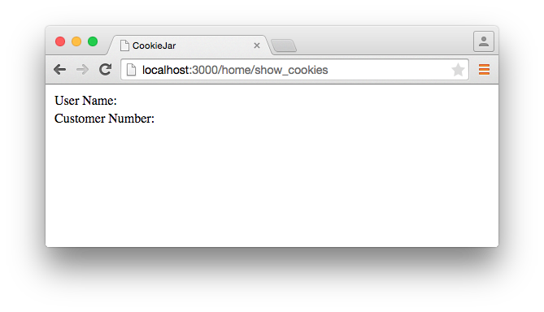
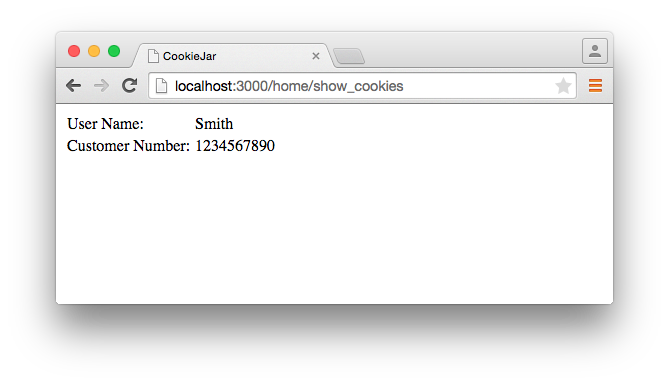
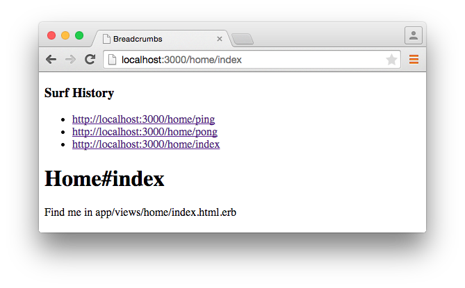

Cookies and Sessions
====================

Cookies
-------

With a cookie, you can store information on the web browser's system, in form
of strings as key-value pairs that the web server has previously sent to this
browser. The information is later sent back from the browser to the server in
the HTTP header. A cookie (if configured accordingly) is deleted from the
browser system neither by restarting the browser nor by restarting the whole
system. Of course, the browser's user can manually delete the cookie.

> **Note**
>
> A browser does not have to accept cookies and it does not have to save them
> either. But we live in a world where almost every page uses cookies. So most
> users will have enabled the cookie functionality. For more information on
> cookies, please visit Wikipedia at
> <http://en.wikipedia.org/wiki/Http_cookie.>

> **Tip**
>
> A cookie can only have a limited size (the maximum is 4 kB). You should
> remember that the information of the saved cookies is sent from the browser
> to the server. So you should only use cookies for storing small amounts of
> data (for example, a customer number) to avoid the protocol overhead
> becoming too big.

Rails provides a hash with the name `cookies[]` that we can use transparently.
Rails automatically takes care of the technological details in the background.

To demonstrate how cookies work, we are going to build a Rails application
that places a cookie on a page, reads it out on another page and displays the
content, and the cookie is deleted on a third page.

```bash
$ rails new cookie_jar
  [...]
$ cd cookie_jar
$ rails generate controller home set_cookies show_cookies delete_cookies
  [...]
$
```

We populate the controller file `app/controllers/home_controller.rb` as
follows:

```ruby
class HomeController < ApplicationController
  def set_cookies
    cookies[:user_name]   = "Smith"
    cookies[:customer_number] = "1234567890"
  end

  def show_cookies
    @user_name    = cookies[:user_name]
    @customer_number = cookies[:customer_number]
  end

  def delete_cookies
    cookies.delete :user_name
    cookies.delete :customer_number
  end
end
```

And the view file `app/views/home/show_cookies.html.erb` as follows:

```erb
<table>
  <tr>
    <td>User Name:</td>
    <td><%= @user_name %></td>
  </tr>
  <tr>
    <td>Customer Number:</td>
    <td><%= @customer_number %></td>
  </tr>
</table>
```

Start the Rails server with `rails server` and go to the URL
<http://localhost:3000/home/show_cookies> in your browser. You will not see
any values.



Now go to the URL <http://localhost:3000/home/set_cookies> and then back to
<http://localhost:3000/home/show_cookies>. Now you will see the values that we
have set in the method `set_cookies`.



By requesting the page <http://localhost:3000/home/delete_cookies> you can
delete the cookies again.

> **Note**
>
> The cookies you have placed in this way stay "alive" in the browser
> until you close the browser completely.

> **Warning**
>
> The content of a normally cookie in the browser is easy to read and to be
> manipulated by the user. It is not encrypted, so it should not contain any
> passwords or similar data. Nor is it advisable to save shopping baskets in
> an unsigned (see [the section called "Signed Cookies"](#signed-cookies))
> cookie, otherwise the user could change the prices in this shopping basket
> himself.

### Permanent Cookies

Cookies are normally set to give the application a way of recognizing users
when they visit again later. Between these visits to the website, much time
can go by and the user may well close the browser in the meantime. To store
cookies for longer than the current browser session, you can use the method
permanent. Our above example can be expanded by adding this method in the
`app/controllers/home_controller.rb`:

```ruby
class HomeController < ApplicationController
  def set_cookies
    cookies.permanent[:user_name]   = "Smith"
    cookies.permanent[:customer_number] = "1234567890"
  end

  def show_cookies
    @user_name    = cookies[:user_name]
    @customer_number = cookies[:customer_number]
  end

  def delete_cookies
    cookies.delete :user_name
    cookies.delete :customer_number
  end
end
```

> **Important**
>
> "permanent" here does not really mean permanent. You cannot set a cookie
> permanently. When you set a cookie, it always needs a "valid until" stamp
> that the browser can use to automatically delete old cookies. With the
> method permanent this value is set to today's date in 20 years. This is
> practically the same as permanent.

### Signed Cookies

With normally placed cookies, you have no option on the application side to
find out if the user of the application has changed the cookie. This can
quickly lead to security problems, as changing the content of a cookie in the
browser is no great mystery. The solution is signing the cookies with a key
that is only known to us. This key is automatically created via a random
generator with each `rails new` and is located in the file
`config/initializers/secret_token.rb`:

```ruby
CookieJar::Application.config.secret_key_base = '85ec675d7702707667a25a'
```   

> **Warning**
>
> If you want to set up your Rails application from scratch again one
> day and start over with a fresh Rails project, it can be helpful to
> transfer this key into the new Rails application. Otherwise you can no
> longer use the previously placed cookies!

To sign cookies, you can use the method `signed`. You have to use it for
writing and reading the cookie. Our above example can be expanded by
adding this method in the `app/controllers/home_controller.rb`:

```ruby
class HomeController < ApplicationController
  def set_cookies
    cookies.permanent.signed[:user_name]   = "Smith"
    cookies.permanent.signed[:customer_number] = "1234567890"
  end

  def show_cookies
    @user_name       = cookies.signed[:user_name]
    @customer_number = cookies.signed[:customer_number]
  end

  def delete_cookies
    cookies.delete :user_name
    cookies.delete :customer_number
  end
end
```

The content of the cookie is now saved in encrypted form every time you
set the cookie. The name of the cookie can still be read by the user,
but not the value.

Sessions
--------

As HTTP is a stateless protocol, we encounter special problems when developing
applications. An individual web page has no connection to the next web page
and they do not know of one another. But as you want to register only once on
many websites, not over and over again on each individual page, this can pose
a problem. The solution is called session and Rails offers it to the
programmer transparently as a `session[]` hash. Rails automatically creates a
new session for each new visitor of the web page. This session is saved by
default as cookie (see [Section
"Cookies"](chapter08-cookies-and-sessions.html) and so it is subject to the 4
kB limit. But you can also store the sessions in the database (see [the
section called "Saving Sessions in the
Database"](#saving-sessions-in-the-database)). An independent and unique
session ID is created automatically and the cookie is deleted by default when
the web browser is closed.

The beauty of a Rails session is that we can not just save strings there as
with cookies, but also hashes and arrays. So you can for example use it to
conveniently implement a shopping cart in an online shop.

### Breadcrumbs via Session

As an example, we create an application with a controller and three views.
When a view is visited, the previously visited views are displayed in a little
list.

The basic application:

```bash
$ rails new breadcrumbs
  [...]
$ cd breadcrumbs
$ rails generate controller Home ping pong index
  [...]
$
```

First we create a method with which we can save the last three URLs in the
session and set an instance variable `@breadcrumbs,` to be able to neatly
retrieve the values in the view. To that end, we set up a `before_filter` in
the `app/controllers/home_controller.rb`:

```ruby
class HomeController < ApplicationController
  before_filter :set_breadcrumbs

  def ping
  end

  def pong
  end

  def index
  end

  private
  def set_breadcrumbs
    if session[:breadcrumbs]
      @breadcrumbs = session[:breadcrumbs]
    else
      @breadcrumbs = Array.new
    end

    @breadcrumbs.push(request.url)

    if @breadcrumbs.count > 4
      # shift removes the first element
      @breadcrumbs.shift
    end

    session[:breadcrumbs] = @breadcrumbs
  end
end
```

Now we use the `app/views/layouts/application.html.erb` to display these
last entries at the top of each page:

```erb
<!DOCTYPE html>
<html>
<head>
  <title>Breadcrumbs</title>
  <%= stylesheet_link_tag    'application', media: 'all',
  'data-turbolinks-track' => true %>
  <%= javascript_include_tag 'application', 'data-turbolinks-track' => true %>
  <%= csrf_meta_tags %>
</head>
<body>

<% if @breadcrumbs && @breadcrumbs.count > 1 %>
  <h3>Surf History</h3>
  <ul>
    <% @breadcrumbs[0..2].each do |breadcrumb| %>
      <li><%= link_to breadcrumb, breadcrumb %></li>
    <% end %>
  </ul>
<% end %>

<%= yield %>

</body>
</html>

<html>
```

Now you can start the Rails server with `rails server` and go to
<http://localhost:3000/home/ping>, <http://localhost:3000/home/pong> or
<http://localhost:3000/home/index> and at the top you will then always see the
pages that you have visited before. Of course, this only works on the second
page, because you do not yet have a history on the first page you visit.



### reset\_session

Occasionally, there are situations where you want to reset a session (in other
words, delete the current session and start again with a new, fresh session).
For example, if you log out of a web application, the session will be reset.
This is easily done and we can quickly integrate it into our breadcrumb
application (see [the section called "Breadcrumbs via
Session"](#breadcrumbs-via-session)):

```bash
$ rails generate controller Home reset -s
        skip  app/controllers/home_controller.rb
       route  get 'home/reset'
      invoke  erb
       exist    app/views/home
      create    app/views/home/reset.html.erb
      invoke  test_unit
        skip    test/controllers/home_controller_test.rb
      invoke  helper
   identical    app/helpers/home_helper.rb
      invoke    test_unit
      invoke  assets
      invoke    coffee
   identical      app/assets/javascripts/home.coffee
      invoke    scss
   identical      app/assets/stylesheets/home.scss
$   
```

The correspondingly expanded controller
`app/controllers/home_controller.rb` then looks like this:

```ruby
class HomeController < ApplicationController
  before_filter :set_breadcrumbs

  def ping
  end

  def pong
  end

  def index
  end

  def reset
    reset_session
    @breadcrumbs = nil
  end

  private
  def set_breadcrumbs
    if session[:breadcrumbs]
      @breadcrumbs = session[:breadcrumbs]
    else
      @breadcrumbs = Array.new
    end

    @breadcrumbs.push(request.url)

    if @breadcrumbs.count > 4
      # shift removes the first element
      @breadcrumbs.shift
    end

    session[:breadcrumbs] = @breadcrumbs
  end
end
```

So you can delete the current session by going to the URL
<http://localhost:3000/home/reset>.

> **Note**
>
> It is not just important to invoke `reset_session`, but you need to also set
> the instance variable `@breadcrumbs` to `nil`. Otherwise, the old
> breadcrumbs would still appear in the view..

### Saving Sessions in the Database

Saving the entire session data in a cookie on the user's browser is not always
the best solution. Amongst others, the limit of 4 kB can pose a problem. But
it's no big obstacle, we can relocate the storing of the session from the
cookie to the database with the Active Record Session Store gem
(<https://github.com/rails/activerecord-session_store>). Then the session ID
is of course still saved in a cookie, but the whole other session data is
stored in the database on the server.

To install the gem we have to add the following line at the end of the file
`Gemfile`

```ruby
gem 'activerecord-session_store', github: 'rails/activerecord-session_store'
```

After that we have to run `bundle install`

```bash
$ bundle install
Fetching git://github.com/rails/activerecord-session_store.git
Fetching gem metadata from https://rubygems.org/..........
Fetching version metadata from https://rubygems.org/..
Resolving dependencies...
Using rake 10.4.2
[...]
Using railties 4.2.1
Using activerecord-session_store 0.1.1 from
git://github.com/rails/activerecord-session_store.git (at master)
Using debug_inspector 0.0.2
[...]
$
```

After that we have to run `rails generate active_record:session_migration` and
`rake db:migrate` to create the needed table in the database.

```bash
$  rails generate active_record:session_migration
      create  db/migrate/20150428183919_add_sessions_table.rb
$ rake db:migrate
== 20150428183919 AddSessionsTable: migrating =================================
-- create_table(:sessions)
   -> 0.0019s
-- add_index(:sessions, :session_id, {:unique=>true})
   -> 0.0008s
-- add_index(:sessions, :updated_at)
   -> 0.0008s
== 20150428183919 AddSessionsTable: migrated (0.0037s) ========================
$
```

After that we'll have to change the `session_store` in the file
`config/initializers/session_store.rb` to `:active_record_store`.

```ruby
Breadcrumbs::Application.config.session_store :active_record_store
```

Job done. Now you need to start the server again with `rails server` and
Rails saves all sessions in the database.
