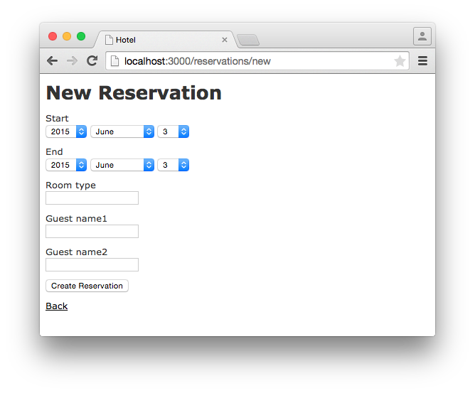
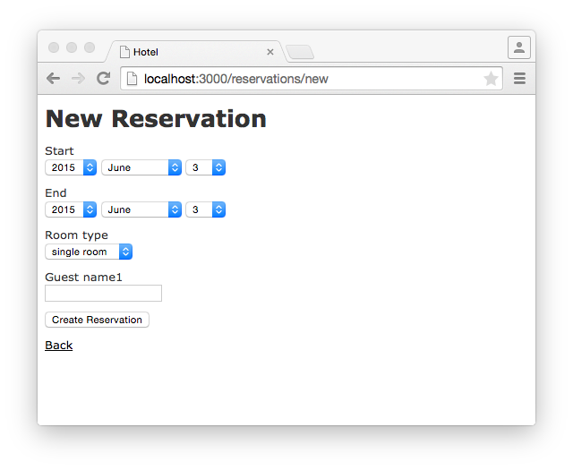
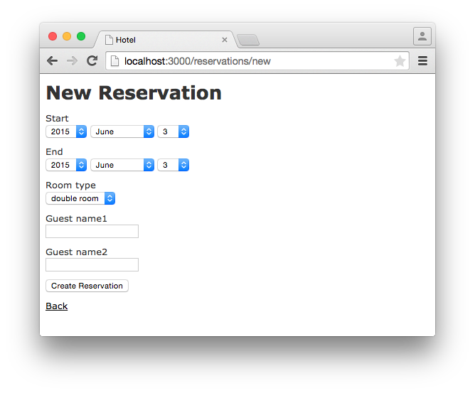

JavaScript
==========

The focus of this chapter is not on explaining JavaScript. The aim is to
show you as a Rails programmer how you can integrate JavaScript in a
Rails application. Correspondingly, the chapters do not explain
JavaScript in detail. I am assuming that you can read and understand
JavaScript. If not, it may be better to skip this chapter. You can
happily get by without JavaScript.

### jQuery

By default, Rails 4 uses the jQuery Javascript library
(<http://jquery.com/>). If you do not require this library, you should
delete the following items from the file
`app/assets/javascripts/application.js` within the asset pipeline (see
[Section "Asset Pipeline"](chapter12-asset-pipeline.html)):

```js
//= require jquery
//= require jquery_ujs
```

With jQuery, you can implement animations and Ajax interactions on your
web page relatively easily.

You will find a good introduction to this topic in the djQuery
documentation at <http://learn.jquery.com/>

### CoffeeScript

For many Rails developers, CoffeeScript is the best thing invented since
the introduction of sliced bread. CoffeeScript is a simple programming
language that is converted to JavaScript via the asset pipeline. I am
going to use JavaScript and CoffeeScript in this chapter. If you would
like to know more about CoffeeScript, please look at the CoffeeScript
documentation at <http://coffeescript.org/> and as so often there is
also an excellent Railscast on CoffeeScript available at
<http://railscasts.com/episodes/267-coffeescript-basics.>

JavaScript Helpers
------------------

For using JavaScript in the view, there are some useful helpers
available.

### javascript\_tag

The easiest way of using JavaScript in a view is via`
      javascript_tag`.

With the following line in the view, you can execute an alert when the
page is accessed:

```erb
<%= javascript_tag "alert('Just an example.')" %>
```

The HTML code generated is this:

```html
<script type="text/javascript">
//<![CDATA[
alert('Just an example.')
//]]>
</script>
```

### link\_to\_function

The helper `link_to_function` creates a link whose `onclick` handler
executes a JavaScript.

Again, here is a example for an alert. The ERB code in the view looks
like this:

```erb
<%= link_to_function "trigger alert", "alert('Just an example.')" %>
```

The generated HTML code:

```html
<a href="#" onclick="alert('Just an example.'); return false;">trigger alert</a>
```

### button\_to\_function

The helper `button_to_function` creates a button whose `onclick` handler
executes a JavaScript.

Once more the example with the alert. The ERB code in the view looks
like this:

```erb
<%= button_to_function "trigger alert", "alert('Just an example.')" %>
```

The generated HTML code:

```html
<input onclick="alert('Just an example.');" type="button" value="trigger alert" />
```

Example
-------

The easiest way of explaining how you go about programming with
JavaScript and the asset pipeline in a Rails project is by using a
little example. As always, the main focus is not on creating an
amazingly meaningful application. ;-)

### Changing Form Depending on Input

Let's build a room reservation where you can book a single or double
room and then have to enter either one or two guest names in the same
form. The basic structure:

```bash
$ rails new hotel
  [...]
$ cd hotel
$ rails generate scaffold reservation start:date end:date room_type:string guest_name1 guest_name2
  [...]
$ rake db:migrate
  [...]
$ rails server
  [...]
```

With this setup we will get a very spartanic
<http://localhost:3000/reservations/new>



That is not userfriendly. The aim is to display the following page when
you go to <http://localhost:3000/reservations/new>:



As soon as the user selects a double room instead of a single, we want a
second name field to appear:



So I am changing two things in the
`app/views/reservations/_form.html.erb`:

-   Set the `room_type` via a dropdown box.

```erb
<%= f.select :room_type, options_for_select(['single room', 'double room']) %>
```

-   In the div element around the second name, I set an ID
    'second_name'.

```erb
<div class="field" id='second_name'>
```

Here is the whole new code for `app/views/reservations/_form.html.erb`

```erb
<%= form_for(@reservation) do |f| %>
  <% if @reservation.errors.any? %>
    <div id="error_explanation">
      <h2><%= pluralize(@reservation.errors.count, "error") %> prohibited this reservation from being saved:</h2>

      <ul>
      <% @reservation.errors.full_messages.each do |message| %>
        <li><%= message %></li>
      <% end %>
      </ul>
    </div>
  <% end %>

  <div class="field">
    <%= f.label :start %><br>
    <%= f.date_select :start %>
  </div>
  <div class="field">
    <%= f.label :end %><br>
    <%= f.date_select :end %>
  </div>
  <div class="field">
    <%= f.label :room_type %><br>
    <%= f.select :room_type, options_for_select(['single room', 'double room']) %>
  </div>
  <div class="field">
    <%= f.label :guest_name1 %><br>
    <%= f.text_field :guest_name1 %>
  </div>
  <div class="field" id='second_name'>
    <%= f.label :guest_name2 %><br>
    <%= f.text_field :guest_name2 %>
  </div>
  <div class="actions">
    <%= f.submit %>
  </div>
<% end %>

```

In the file `app/assets/javascripts/reservations.js.coffee` I define the
CoffeeScript code that toggles the element with the ID `second_name`
between visible (`show`) or invisible (`hide`) depending on the content
of `reservation_room_type`:

```js
ready = ->
  $('#second_name').hide()
  $('#reservation_room_type').change ->
    room_type = $('#reservation_room_type :selected').text()
    if room_type == 'single room'
      $('#second_name').hide()
    else
      $('#second_name').show()

$(document).ready(ready)
$(document).on('page:load', ready)
```

> **Note**
>
> In reality, you would surely integrate the guest names in a 1:n
> `has_many` association, but in this example we just want to demonstrate
> how you can change the content of a form via JavaScript.

Forms
=====

The Data-Input Workflow
-----------------------

To understand forms we take a look at the data workflow. Understanding
it better will help to understand the work of forms.

Example application:

```bash
$ rails new testapp
[...]
$ cd testapp
$ rails generate scaffold Person first_name last_name
[...]
$ rake db:migrate
[...]
$ rails server
=> Rails 4.2.1 application starting in development on http://localhost:3000
=> Run `rails server -h` for more startup options
=> Ctrl-C to shutdown server
[2015-05-05 11:28:45] INFO  WEBrick 1.3.1
[2015-05-05 11:28:45] INFO  ruby 2.2.0 (2014-12-25) [x86_64-darwin14]
[2015-05-05 11:28:45] INFO  WEBrick::HTTPServer#start: pid=88054 port=3000
```

Most times we create forms by using the Scaffold. Let's go through the
flow the data

### Request the people\#new form

Wenn we request the <http://localhost:3000/people/new> URL the router
answers the following route:

```bash
new_person GET    /people/new(.:format)      people#new
```

The controller `app/controllers/people_controller.rb` runs this code:

```ruby
# GET /people/new
def new
  @person = Person.new
end
```

So a new Instance of Person is created and stored in the instance
variable `@person`.

Rails takes `@person` and starts processing the view file
`app/views/people/new.html.erb`

```erb
<h1>New person</h1>

<%= render 'form' %>

<%= link_to 'Back', people_path %>
```

`render 'form'` renders the file `app/views/people/_form.html.erb`

```erb
<%= form_for(@person) do |f| %>
  [...]
    <%= f.text_field :first_name %>
  [...]
    <%= f.text_field :last_name %>
  [...]
    <%= f.submit %>
  [...]
<% end %>
```

`form_for(@person)` embeddeds the two `text_fields` `:first_name` and
`:last_name` plus a `submit` Button.

The resulting HTML:

```html
[...]
<form accept-charset="UTF-8" action="/people" class="new_person" id="new_person" method="post">
  [...]
    <input id="person_first_name" name="person[first_name]" type="text" />
  [...]
    <input id="person_last_name" name="person[last_name]" type="text" />
  [...]
    <input name="commit" type="submit" value="Create Person" />
  [...]
</form>
[...]
```

This form uses the `post` method to upload the data to the server.

### Push the Data to the Server

We enter 'Stefan' in the `first_name` field and `Wintermeyer` in the
`last_name` field and click the submit button. The browser uses the post
method to uploads the data to the URL `/people`. The log shows:

```bash
Started POST "/people" for ::1 at 2015-05-02 18:27:09 +0200
Processing by PeopleController#create as HTML
  Parameters: {"utf8"=>"✓", "authenticity_token"=>"du/D7PTzfkKTVTdP5dHkin3qKS9GFDJDKcm57opVX+dJ1uFczjisX/HZcmgt4MwFgr/IBvof3j3NXpA1vAdTkg==", "person"=>{"first_name"=>"Stefan", "last_name"=>"Wintermeyer"}, "commit"=>"Create Person"}
   (0.1ms)  begin transaction
  SQL (0.7ms)  INSERT INTO "people" ("first_name", "last_name", "created_at", "updated_at") VALUES (?, ?, ?, ?)  [["first_name", "Stefan"], ["last_name", "Wintermeyer"], ["created_at", "2015-05-02 16:27:09.952641"], ["updated_at", "2015-05-02 16:27:09.952641"]]
   (0.9ms)  commit transaction
Redirected to http://localhost:3000/people/1
Completed 302 Found in 14ms (ActiveRecord: 1.7ms)
```

What happend in Rails?

The router answers the request with this route

```bash
POST   /people(.:format)          people#create
```

The controller `app/controllers/people_controller.rb` runs this code

```ruby
# POST /people
# POST /people.json
def create
  @person = Person.new(person_params)
  [...]
    if @person.save
      format.html { redirect_to @person, notice: 'Person was successfully created.' }
    [...]
    end
  end
end
[...]

# Never trust parameters from the scary internet, only allow the white list through.
def person_params
  params.require(:person).permit(:first_name, :last_name)
end
```

A new instance variable `@person` is created. It represense a new Person
which was created with the params that were send from the browser to the
Rails application. The params are checked in the `person_params` method
which is a whitelist. That is done so the user can not just inject
params which we don't want to be injected.

Once `@person` is saved a `redirect_to`
      @person` is triggered. That would be
<http://localhost:3000/people/1> in this example.

### Present the new Data

The redirect to <http://localhost:3000/people/1> is traceable in the log
file

```bash
Started GET "/people/1" for ::1 at 2015-05-02 18:27:09 +0200
Processing by PeopleController#show as HTML
  Parameters: {"id"=>"1"}
  Person Load (0.4ms)  SELECT  "people".* FROM "people" WHERE "people"."id" = ? LIMIT 1  [["id", 1]]
  Rendered people/show.html.erb within layouts/application (1.9ms)
Completed 200 OK in 83ms (Views: 69.2ms | ActiveRecord: 0.4ms)
```

The router answers to this request with

```bash
person GET    /people/:id(.:format)      people#show
```

Which gets handled be the show method in
`app/controllers/people_controller.rb`

Generic Forms
-------------

A form doesn't have to be hardwired to an ActiveRecord object. You can
use the `form_tag` helper to create a form by youself. I use the example
of [http://guides.rubyonrails.org/form\_helpers.html
    ](http://guides.rubyonrails.org/form_helpers.html
    )(which is the official Rails guide about forms) to show how to
create a search form which is not connected to a model:

```erb
<%= form_tag("/search", method: "get") do %>
  <%= label_tag(:q, "Search for:") %>
  <%= text_field_tag(:q) %>
  <%= submit_tag("Search") %>
<% end %>
```

It results in this HTML code:

```html
<form accept-charset="UTF-8" action="/search" method="get">
  <label for="q">Search for:</label>
  <input id="q" name="q" type="text" />
  <input name="commit" type="submit" value="Search" />
</form>
```

To handle this you'd have to create a new route in `config/routes.rb`
and write a method in a controller to handle it.

FormTagHelper
-------------

There is not just a helper for text fields. Have a look at the offical
API documentation for all FormTagHelpers at
<http://api.rubyonrails.org/classes/ActionView/Helpers/FormTagHelper.html>
to get an overview. Because normaly we use Scaffold to create a form
there is no need to memorize them. It is just important to know where to
look in case you need something else.

Alternatives
------------

Many Rails developer use Simple Form as an alternative to the standard
way of defining forms. It is worth a try because you can really safe
time and most of the times it is just easier. Simple Form is available
as a Gem at <https://github.com/plataformatec/simple_form>
